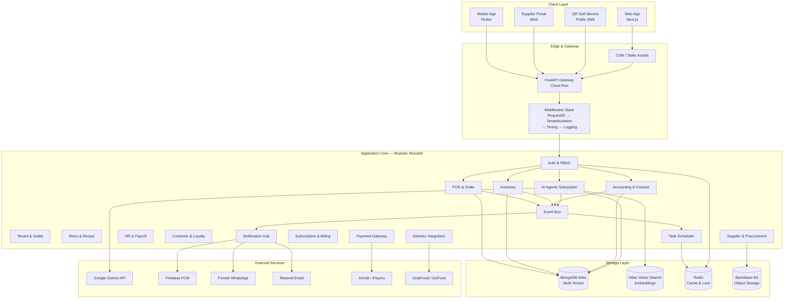
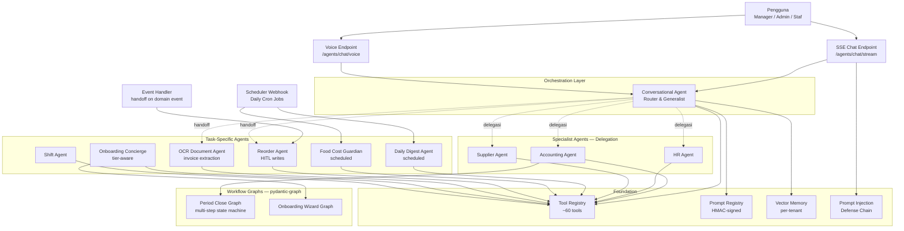

# Ringkasan Project zerlo.id

> Dokumen ini merupakan pengantar umum mengenai project **zerlo.id** yang menjadi
> objek studi dalam Tugas Akhir penulis. Dokumen disusun sebagai bahan diskusi
> awal dengan dosen pembimbing untuk memahami ruang lingkup sistem sebelum
> pembahasan kandidat judul Tugas Akhir dilakukan.

---

## 1. Identitas Project

| Atribut | Nilai |
|---------|-------|
| Nama Produk | **zerlo.id** |
| Kategori | AI-powered Restaurant ERP |
| Segmen Pasar | UMKM Kuliner Indonesia (Food & Beverage Small-Medium Enterprise) |
| Status Pengembangan | Early Startup — Beta Testing Phase |
| Peran Penulis | Developer Utama (Lead Developer) |
| Bahasa Antarmuka | Bahasa Indonesia (utama) dan Bahasa Inggris |
| Domain Deployment | Google Cloud Platform (GCP) — Asia Southeast (Jakarta) |

---

## 2. Latar Belakang Bisnis

Industri kuliner di Indonesia merupakan salah satu sektor Usaha Mikro, Kecil, dan
Menengah (UMKM) dengan kontribusi terbesar terhadap Produk Domestik Bruto (PDB)
nasional. Meskipun demikian, sebagian besar pelaku usaha kuliner skala kecil
hingga menengah masih menghadapi sejumlah tantangan operasional yang signifikan,
khususnya dalam aspek manajemen administratif dan kepatuhan regulasi.

### 2.1 Permasalahan UMKM Kuliner

Berdasarkan observasi terhadap pelaku usaha F&B di Indonesia, ditemukan beberapa
permasalahan utama yang menjadi titik nyeri (*pain point*) operasional:

1. **Manajemen Stok Bahan Baku yang Kompleks.** Restoran dengan multi-outlet
   kesulitan melakukan pemantauan stok secara *real-time*, terutama untuk bahan
   baku perishable (mudah rusak) yang memiliki masa kadaluarsa pendek. Penghitungan
   *food cost* sering dilakukan secara manual menggunakan *spreadsheet*, sehingga
   rentan terhadap kesalahan dan keterlambatan informasi.

2. **Kepatuhan Akuntansi sesuai PSAK.** Pelaporan keuangan yang sesuai dengan
   Pernyataan Standar Akuntansi Keuangan (PSAK) — khususnya PSAK 71 (Instrumen
   Keuangan), PSAK 16 (Aset Tetap), dan PSAK 23 (Pendapatan) — memerlukan
   keahlian akuntansi yang seringkali tidak dimiliki oleh pelaku UMKM. Akibatnya,
   banyak usaha yang masih mengandalkan pencatatan kas-basis sederhana dan
   kesulitan ketika harus melakukan audit atau pengajuan kredit ke perbankan.

3. **Kepatuhan Regulasi BPJPH dan BPOM.** Sertifikasi halal dari Badan
   Penyelenggara Jaminan Produk Halal (BPJPH) dan izin edar dari Badan Pengawas
   Obat dan Makanan (BPOM) wajib dipenuhi untuk produk-produk tertentu. Pelacakan
   nomor sertifikat per batch bahan baku menjadi tantangan tersendiri.

4. **Operasional Multi-Outlet.** Pengelolaan beberapa outlet sekaligus memerlukan
   sistem yang dapat menangani konfigurasi yang berbeda per outlet (harga, menu,
   pajak, jam operasional) sambil tetap mempertahankan konsolidasi laporan di
   level tenant (pemilik usaha).

5. **Biaya Software ERP Konvensional yang Tinggi.** Solusi ERP enterprise seperti
   SAP, Oracle NetSuite, atau Microsoft Dynamics memiliki biaya lisensi dan
   implementasi yang tidak terjangkau oleh UMKM. Sementara itu, solusi POS
   sederhana yang tersedia di pasar Indonesia umumnya tidak menyediakan modul
   akuntansi, inventory, dan compliance secara terintegrasi.

6. **Beban Administratif yang Repetitif.** Pekerjaan rutin seperti analisis food
   cost harian, pembuatan jurnal akuntansi, perhitungan reorder point, dan
   ekstraksi data dari faktur supplier memakan waktu signifikan dari pemilik
   usaha — waktu yang seharusnya dapat dialokasikan untuk pengembangan bisnis.

### 2.2 Peluang Pasar

Berkembangnya teknologi *Large Language Model* (LLM) generatif sejak tahun 2023
membuka peluang baru untuk mengotomasi pekerjaan administratif berbasis bahasa
alami. Hal ini memungkinkan pengembangan sistem ERP yang tidak hanya berfungsi
sebagai pencatat transaksi (*system of record*), tetapi juga sebagai asisten
virtual yang proaktif dalam memberikan rekomendasi dan menjalankan tugas atas
nama pengguna (*system of action*).

---

## 3. Visi Produk

zerlo.id dirancang sebagai **AI-first Restaurant ERP** yang menggantikan
pekerjaan administratif rutin dengan agen-agen otonom (*autonomous agents*) yang
memahami konteks operasional restoran Indonesia dan berkomunikasi dalam Bahasa
Indonesia.

### 3.1 Prinsip Desain

1. **AI-First, bukan AI-Added.** Agen AI bukan fitur tambahan, melainkan bagian
   inti dari arsitektur sistem. Pengguna dapat berinteraksi dengan sistem
   melalui antarmuka percakapan (*conversational interface*) untuk hampir semua
   kebutuhan operasional.

2. **Kepatuhan Regulasi Indonesia sebagai Default.** PSAK, BPJPH, BPOM, format
   nomor telepon Indonesia, normalisasi NPWP, dan format pajak PPN 11% sudah
   tertanam dalam logika bisnis sistem.

3. **Multi-Tenancy yang Aman.** Setiap tenant (pemilik usaha) memiliki ruang
   data yang terisolasi sepenuhnya. Setiap query database wajib menyertakan
   `tenant_id` sebagai *security primitive* di level basis data.

4. **Human-in-the-Loop untuk Operasi Sensitif.** Agen AI tidak dapat melakukan
   operasi tulis (*write operation*) secara otonom. Setiap perubahan data harus
   melalui mekanisme *staging* dan konfirmasi oleh pengguna manusia berperan
   manajer.

5. **Modular dan Berskala.** Sistem dirancang sebagai *Modular Monolith* dengan
   batas modul yang tegas, sehingga dapat dipecah menjadi *microservices* di
   masa depan apabila kebutuhan skala meningkat.

### 3.2 Pekerjaan yang Diotomasi oleh Agen AI

| Pekerjaan Manual Tradisional | Otomasi oleh zerlo.id |
|------------------------------|------------------------|
| Analisis food cost mingguan | **Food Cost Guardian Agent** — analisis harian + rekomendasi resep |
| Posting jurnal akuntansi | **Auto Journal Service** + **Accounting Agent** |
| Pembuatan Purchase Order untuk reorder | **Reorder Agent** — staging + manager confirmation |
| Ekstraksi data dari faktur supplier | **OCR Document Agent** — Gemini Vision + auto journal |
| Laporan harian kondisi bisnis | **Daily Digest Agent** — eksekusi terjadwal |
| Onboarding tenant baru | **Onboarding Concierge Agent** |
| Tanya-jawab data operasional | **Conversational Agent** + delegation ke spesialis |
| Penjadwalan shift karyawan | **Shift Agent** |

---

## 4. Status Saat Ini

Project zerlo.id berada pada fase **early startup** dengan tahap pengembangan
**beta testing**. Karakteristik tahap ini meliputi:

- Sistem inti (POS, Inventory, Accounting, HR, Supplier) telah selesai
  diimplementasikan dan teruji secara fungsional.
- Sub-sistem AI Agents telah mencapai 11 agen dengan empat level orkestrasi
  multi-agen yang berfungsi.
- Deployment produksi pada infrastruktur GCP Cloud Run di region
  asia-southeast1 (Jakarta).
- Dokumentasi pengembang dan dokumentasi API telah disusun secara terstruktur
  pada repository terpisah (`restaurant-erp-docs`).
- Pengujian terbatas dengan beberapa tenant pilot di sektor F&B.
- Iterasi cepat berdasarkan umpan balik dari pengguna beta.

Tahap ini belum mencapai *general availability* (GA), dan masih terdapat
peningkatan-peningkatan yang dilakukan secara berkelanjutan, terutama pada
aspek pengalaman pengguna, keandalan agen AI, dan integrasi dengan layanan
pihak ketiga.

---

## 5. Stack Teknologi

Pemilihan teknologi dilakukan dengan pertimbangan: kematangan ekosistem,
dukungan komunitas, kemudahan operasional pada skala startup, serta kompatibilitas
dengan kebutuhan integrasi AI generatif.

| Layer | Teknologi | Alasan Pemilihan |
|-------|-----------|------------------|
| Bahasa Pemrograman | **Python 3.12+** | Ekosistem AI/ML yang matang; sintaks yang ekspresif untuk *domain modeling* |
| Web Framework | **FastAPI** | Native async, OpenAPI auto-generation, type-safety melalui Pydantic |
| Validasi & Serialisasi | **Pydantic v2** | Performa tinggi (Rust-backed), tipe yang ketat, integrasi langsung dengan FastAPI |
| Basis Data Utama | **MongoDB Atlas (PyMongo Async)** | Skema fleksibel untuk evolusi cepat; dukungan native untuk *vector search* |
| Cache & Lock | **Redis** | Distributed locking, rate limiting, circuit breaker state |
| AI Agent Framework | **Pydantic AI 1.83.0** | Type-safe tool registration, integrasi alami dengan Pydantic v2 |
| Workflow Graph | **pydantic-graph 1.83.0** | State machine untuk workflow multi-step yang resumable |
| LLM Provider | **Google Gemini** (gemini-2.5-flash-lite, flash, embedding-001) | Kualitas Bahasa Indonesia yang baik, harga kompetitif, dukungan tool calling |
| Vector Database | **MongoDB Atlas Vector Search** | Reuse cluster yang sama; native `filter` clause untuk *multi-tenant isolation* |
| Compute | **GCP Cloud Run** | *Serverless container* dengan auto-scale; cocok untuk beban yang fluktuatif |
| Task Scheduler | **GCP Cloud Tasks** + **Cloud Scheduler** | Eksekusi terjadwal hingga 30 hari (Cloud Tasks) dan cron (Scheduler) |
| Event Bus | **GCP Pub/Sub** | Decoupling antar modul melalui *domain events* |
| Email | **Resend** (primary), **AWS SES** (fallback) | Deliverability tinggi, pricing transparan |
| WhatsApp | **Fonnte** | Penyedia API WhatsApp untuk pasar Indonesia |
| Push Notification | **Firebase Cloud Messaging (FCM)** | Standar industri untuk mobile push |
| Storage | **Backblaze B2** | Object storage berbiaya rendah untuk dokumen dan gambar |
| Payment Gateway | **Xendit**, **iPaymu** | Cakupan metode pembayaran lokal Indonesia |
| Quality Assurance | **pytest**, **mypy**, **ruff**, **black** | Pengujian otomatis, *type-checking* statis, linting |
| Containerization | **Docker** | Konsistensi environment dev → staging → prod |

---

## 6. Arsitektur High-Level

Sistem zerlo.id mengadopsi arsitektur **Modular Monolith** dengan **Clean
Architecture** di setiap modul. Pendekatan ini dipilih karena memberikan
keseimbangan antara kemudahan deployment (satu unit deployment) dengan
ketegasan batas modul (isolasi domain logic).



### 6.1 Lapisan Clean Architecture per Modul

Setiap modul (misalnya `inventory`, `accounting`, `ai_agents`) mengikuti struktur
direktori yang konsisten:

```
src/modules/{nama_modul}/
├── domain/          # Entitas bisnis, value objects, enum domain
├── application/     # Service classes, use cases, orchestration
├── infrastructure/  # Repository (akses MongoDB), client eksternal
└── api/             # Routes FastAPI, request/response schemas
```

Aturan dependensi: `api → application → domain` dan
`infrastructure → domain`. Domain tidak boleh bergantung pada lapisan luar.

---

## 7. Modul-Modul Utama

Sistem terdiri dari 38 modul fungsional. Berikut ini adalah modul-modul terpenting
yang membentuk inti operasional:

| No | Modul | Fungsi Utama |
|----|-------|--------------|
| 1 | **auth** | Autentikasi JWT, RBAC, manajemen sesi staf |
| 2 | **tenant** | Profil tenant, settings operasional, *multi-tenancy* primitives |
| 3 | **outlet** | Manajemen cabang/outlet, hierarki outlet group |
| 4 | **pos** | Point of Sale, transaksi, shift kasir, struk |
| 5 | **order** | Manajemen order (dine-in, takeaway, delivery), siklus order |
| 6 | **menu** | Katalog menu, kombo meal, varian harga, lokalisasi |
| 7 | **inventory** | Stok bahan baku, batch traceability, BPJPH/BPOM, opname, transfer antar-outlet, production order untuk commissary |
| 8 | **supplier** | Master supplier, kontrak, scorecard, AP aging, B2B portal |
| 9 | **accounting** | Chart of Accounts, journal entries, sales/AP invoices, fixed assets (PSAK 16), FX revaluation (PSAK 71), period close orchestrator, consolidation |
| 10 | **hr** | Karyawan, payroll, shift scheduling, attendance |
| 11 | **customer** | Profil customer, segmentasi, customer 360°, credit limit |
| 12 | **loyalty** | Program loyalty (points + stamp card), tier upgrade |
| 13 | **promo** + **voucher** + **combo** | Engine kampanye marketing |
| 14 | **delivery** | Integrasi GrabFood, GoFood, ShopeeFood (webhook + adapter) |
| 15 | **subscription** | Tier-gating, plan config, billing cycle |
| 16 | **payment** + **xendit** + **ipaymu** | Multi-gateway payment abstraction |
| 17 | **self_service** | QR ordering, multi-bahasa, post-checkout modify |
| 18 | **notification** | Multi-channel notification hub (email/WA/push/in-app) |
| 19 | **scheduler** | Task scheduler dengan tiering MongoDB ↔ Cloud Tasks |
| 20 | **ai_agents** | *AI Agent subsystem* — lihat Bagian 8 |
| 21 | **bulk_import** | Import data massal (menu, supplier, employee) |
| 22 | **storage** | Abstraksi object storage (B2) |
| 23 | **compliance** | Audit log, KYC, fraud scoring, disbursement |
| 24 | **exchange_rate** | *Reference data* nilai tukar mata uang (modul global, lintas-tenant) |

---

## 8. AI Agent Subsystem (Highlight Utama)

Sub-sistem AI Agents merupakan *unique selling proposition* dari project
zerlo.id dan menjadi pembeda utama dari produk-produk ERP konvensional yang
beredar di pasar.

### 8.1 Topologi Fleet AI Agent



### 8.2 Daftar Agen yang Telah Di-deploy

Sub-sistem AI Agents saat ini terdiri dari **11 agen** yang telah berjalan di
production:

1. **Conversational Agent** — *generalist* dan *router*. Berfungsi sebagai
   antarmuka percakapan utama pengguna. Mendelegasikan pertanyaan teknis ke
   agen spesialis (Accounting, HR, Supplier) ketika diperlukan.

2. **Accounting Agent** — spesialis akuntansi. Menjawab pertanyaan terkait laporan
   laba rugi, neraca, arus kas, jurnal entry, dan periode close. Memiliki
   pembatasan akses ke role finance/admin.

3. **HR Agent** — spesialis sumber daya manusia. Menangani pertanyaan terkait
   karyawan, payroll, dan attendance.

4. **Supplier Agent** — spesialis manajemen supplier. Menjawab pertanyaan
   tentang AP aging, scorecard supplier, dan rekomendasi sourcing.

5. **Daily Digest Agent** — agen terjadwal. Setiap pagi mengirimkan ringkasan
   harian kondisi bisnis (KPI, anomali, rekomendasi tindakan) ke pemilik usaha.

6. **Food Cost Guardian Agent** — agen terjadwal. Menganalisis perbedaan antara
   food cost teoretis (berdasarkan resep) dengan aktual (berdasarkan stok),
   serta memberikan rekomendasi perbaikan.

7. **Reorder Agent** — agen *write-capable*. Menghasilkan saran Purchase Order
   berdasarkan reorder point dan tren konsumsi. Eksekusi melalui mekanisme
   *staging* + manager confirmation.

8. **OCR Document Agent** — agen pengolah dokumen. Mengekstraksi data dari
   faktur supplier (gambar/PDF) menggunakan Gemini Vision, kemudian membuat
   draft Supplier Invoice yang akan dikonfirmasi oleh manager.

9. **Onboarding Concierge Agent** — agen pendamping tenant baru. Memandu
   pengaturan awal sistem (outlet, menu, supplier) secara *tier-aware* sesuai
   dengan paket berlangganan tenant.

10. **Shift Agent** — agen penjadwalan shift karyawan dengan
    mempertimbangkan ketersediaan dan beban kerja.

11. **Workflow Graph Agents** (pydantic-graph) — orchestrator multi-step
    untuk **Period Close** (penutupan periode akuntansi: accruals → depreciation
    → FX revaluation → doubtful debt → trial balance) dan **Onboarding Wizard**.

### 8.3 Empat Level Orkestrasi Multi-Agen

Sistem mendukung empat tingkat kompleksitas orkestrasi agen:

| Level | Pola | Contoh |
|-------|------|--------|
| **1. Single Agent** | Satu agen menangani satu turn | Daily Digest |
| **2. Agent Delegation** | LLM memanggil tool `ask_*_expert` mid-turn | Conversational → Accounting Agent |
| **3. Programmatic Hand-Off** | Application code mengantarkan output antar agen | Event-driven escalation |
| **4. Workflow Graph** | State machine multi-step yang resumable | Period Close orchestrator |

### 8.4 Tool Registry & Framework Guarantees

Semua tool yang dapat dipanggil oleh agen didaftarkan melalui **Tool Registry**
terpusat (`@register(meta=ToolMeta(...))`). Framework menjamin:

- **Tenant Isolation** — `tenant_id` selalu berasal dari JWT, tidak pernah
  dari LLM.
- **Role Denial** — tool yang tidak boleh diakses role tertentu disaring
  sebelum sampai ke LLM.
- **Tier Gating** — fitur premium hanya tersedia bagi tenant dengan
  paket berlangganan yang sesuai.
- **Write Staging** — operasi tulis selalu melalui *staging* +
  konfirmasi manusia.
- **Budget Cap** — maksimal 15 tool yang ditampilkan ke LLM per turn untuk
  mengontrol biaya dan latensi.

### 8.5 Prompt Injection Defense Chain

Setiap permintaan ke endpoint chat melalui rantai pertahanan berlapis:

```
1. InjectionCounter (lockout check)
2. UserInputGuard (delimiter strip + deny-list + length cap)
3. apply_registry_prompt (HMAC-verified prompt)
4. agent.run() — eksekusi tool server-side
5. PIIRedactor (redaksi nomor telepon + NPWP)
6. OutputLeakDetector
7. SSE chunk emit
```

Setiap output tool yang berasal dari data eksternal (nama customer, hasil
OCR, dokumen RAG) dibungkus dalam tag `<UNTRUSTED_DATA>` agar LLM
memperlakukannya sebagai data, bukan instruksi.

---

## 9. Karakteristik Sistem (Modal Kuantitatif untuk Analisis)

Tabel berikut merangkum karakteristik kuantitatif sistem yang dapat menjadi
modal data dalam Bab Analisis Tugas Akhir.

| Aspek | Nilai |
|-------|-------|
| Jumlah modul fungsional | **38** |
| Jumlah HTTP endpoint | **±1.176** |
| Jumlah service method | **±1.626** |
| Jumlah AI agent terdeploy | **11** |
| Jumlah tool yang terdaftar di Tool Registry | **±60** |
| Level orkestrasi multi-agen | **4** (single, delegation, hand-off, graph) |
| Jumlah domain event yang terdefinisi | **±70** |
| Jumlah scheduled task / cron job | **±15** |
| Jumlah payment gateway terintegrasi | **2** (Xendit, iPaymu) |
| Jumlah delivery platform terintegrasi | **3** (GrabFood, GoFood, ShopeeFood) |
| Jumlah notification channel | **4** (email, WhatsApp, push, in-app) |
| Provider LLM | **1** (Google Gemini, multi-model) |
| Bahasa Pemrograman utama | **Python 3.12+** |
| Framework AI agent | **Pydantic AI 1.83.0** |
| Workflow graph framework | **pydantic-graph 1.83.0** |
| Tipe basis data | MongoDB (dokumen) + Atlas Vector Search (embedding) + Redis (cache) |
| Region deployment | asia-southeast1 (Jakarta) |
| Arsitektur | Modular Monolith dengan Clean Architecture |
| Status | Beta Testing (early startup) |

### 9.1 Aspek Riset yang Layak Eksplorasi

Sistem zerlo.id mencakup beragam topik akademis yang relevan dengan bidang
Sistem Informasi, antara lain:

1. **Multi-Agent System Engineering** — orkestrasi agen LLM dengan jaminan
   keamanan dan biaya terkendali.
2. **Prompt Injection Defense** — defense-in-depth untuk sistem berbasis LLM.
3. **Multi-Tenancy Security** — isolasi data dengan vector search.
4. **Domain-Driven Design** — Clean Architecture pada Modular Monolith.
5. **Event-Driven Architecture** — *event bus* dengan dual backend (in-memory
   + Pub/Sub) dan *handler wiring contract*.
6. **Compliance Engineering** — implementasi PSAK, BPJPH, BPOM dalam kode.
7. **Human-in-the-Loop System Design** — pola *stage → confirm → dispatch*.
8. **Retrieval-Augmented Generation (RAG)** — vector memory per-tenant.
9. **Observability AI Agents** — *trace*, audit log, dan biaya per turn LLM.
10. **API Quality dan Developer Experience** — auto-generated OpenAPI docs.

---

## 10. Hubungan Project dengan Tugas Akhir

### 10.1 Posisi Penulis

Penulis adalah **developer utama** pada project zerlo.id sejak fase awal
pengembangan. Seluruh keputusan arsitektur, implementasi modul, dan integrasi
sub-sistem AI Agents dilakukan oleh penulis dengan berkonsultasi pada referensi
industri dan literatur akademis.

### 10.2 Project sebagai Objek Studi

Project zerlo.id telah berjalan secara mandiri sebagai produk komersial pada
fase beta testing — terlepas dari kebutuhan akademis Tugas Akhir. Hal ini
memberikan keuntungan akademis berikut:

1. **Real-World Validity.** Sistem yang dianalisis bukan prototipe akademis,
   melainkan sistem produksi dengan pengguna nyata.
2. **Volume Data.** Skala kode, jumlah modul, dan jumlah endpoint cukup untuk
   menjadi objek studi yang signifikan.
3. **Kebaruan Topik.** Penggunaan LLM dan pola multi-agen merupakan topik yang
   masih sedikit dibahas pada literatur Sistem Informasi Indonesia.
4. **Ketersediaan Data Pendukung.** Dokumentasi internal, log eksekusi, *trace*
   AI agent, dan audit log tersedia sebagai bahan analisis.

### 10.3 Pendekatan: Satu Sudut Pandang dari Project Besar

Mengingat luasnya cakupan sistem, Tugas Akhir tidak akan membahas project
zerlo.id secara keseluruhan. Tugas Akhir akan **mengambil satu sudut pandang
spesifik** yang fokus dan dapat diteliti secara mendalam dalam keterbatasan
ruang lingkup skripsi S1.

Beberapa kandidat sudut pandang yang dapat menjadi fokus Tugas Akhir antara
lain (untuk didiskusikan dengan dosen pembimbing):

- **Sudut Pandang Arsitektural:** Analisis penerapan Modular Monolith dengan
  Clean Architecture pada sistem ERP berbasis AI.
- **Sudut Pandang AI Agent:** Desain dan evaluasi sub-sistem multi-agen dengan
  pola orkestrasi berlapis.
- **Sudut Pandang Keamanan:** Implementasi *defense-in-depth* terhadap
  *prompt injection* pada sistem produksi.
- **Sudut Pandang Compliance:** Implementasi otomasi kepatuhan PSAK / BPJPH /
  BPOM melalui *domain-driven design*.
- **Sudut Pandang Otomasi Bisnis:** Pengukuran dampak otomasi pekerjaan
  administratif terhadap produktivitas UMKM kuliner.
- **Sudut Pandang Multi-Tenancy:** Strategi isolasi data lintas-tenant pada
  vector search dan embedding.
- **Sudut Pandang Human-in-the-Loop:** Desain pola *staging* dan konfirmasi
  pada operasi tulis berbasis LLM.

Pemilihan sudut pandang final akan dilakukan bersama dosen pembimbing dengan
mempertimbangkan kebaruan topik, kelayakan riset dalam batasan waktu, dan
ketersediaan literatur pendukung.

---

## 11. Penutup

Dokumen ini bertujuan memberikan gambaran umum project zerlo.id sebagai bekal
awal diskusi penentuan judul Tugas Akhir. Dokumen-dokumen berikutnya akan
memperdalam aspek-aspek tertentu sesuai dengan arah riset yang disepakati
bersama dosen pembimbing.

Penulis terbuka untuk pertanyaan, klarifikasi, dan masukan lebih lanjut dari
dosen pembimbing terkait ruang lingkup, kedalaman analisis, serta arah Tugas
Akhir yang paling sesuai dengan kompetensi penulis dan kontribusi keilmuan
yang diharapkan oleh program studi.

---

*Dokumen ini merupakan bagian dari rangkaian dokumen pengantar Tugas Akhir.
File-file selanjutnya akan membahas kandidat-kandidat judul, tinjauan pustaka,
serta proposal metodologi penelitian.*
