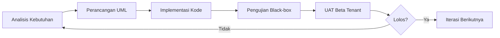
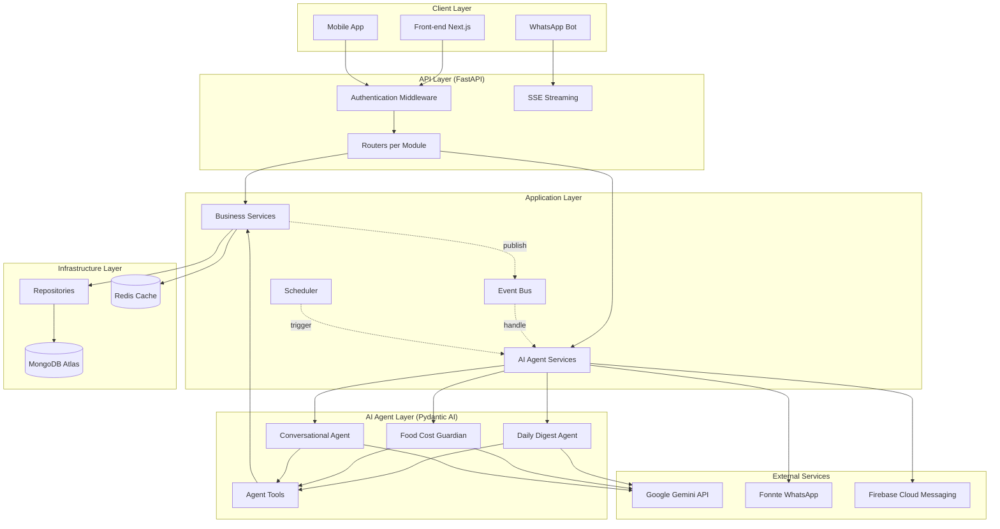
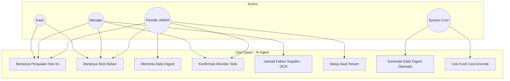
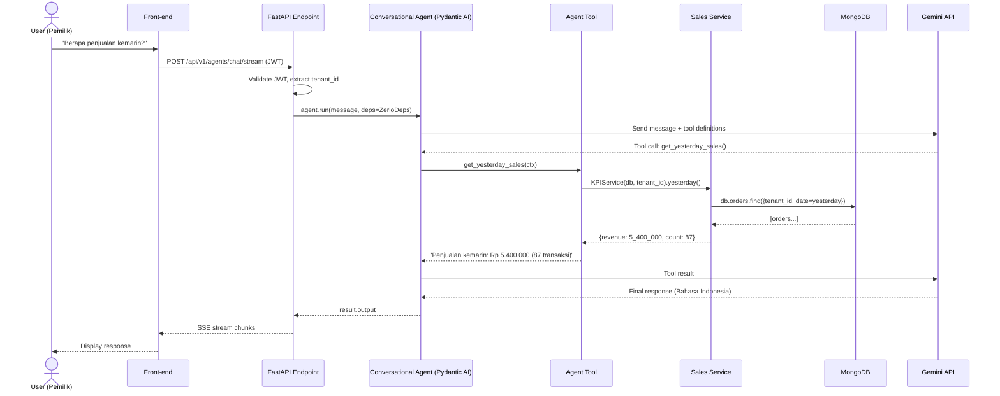
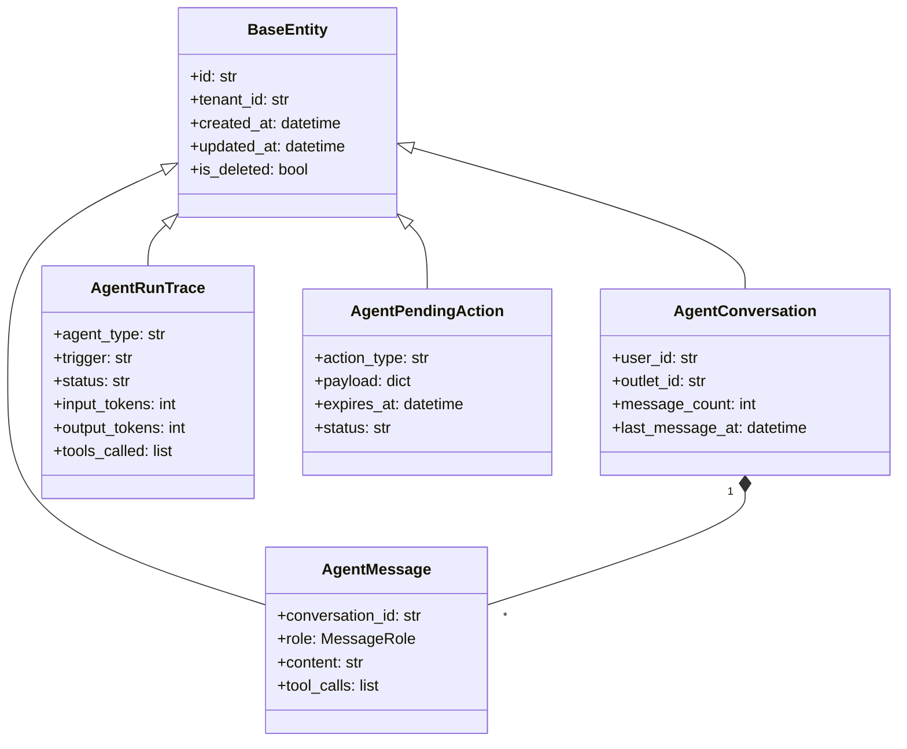

# Kandidat Judul A — Rancang Bangun (Engineering)

> Dokumen diskusi pembimbing — Tugas Akhir S1 Sistem Informasi
> Mahasiswa: Developer utama proyek **zerlo.id** (AI-powered Restaurant ERP)
> Tanggal: 2026-05-02

---

## Daftar Isi

1. [Judul yang Diusulkan](#1-judul-yang-diusulkan)
2. [Ringkasan / Pitch](#2-ringkasan--pitch)
3. [Latar Belakang](#3-latar-belakang)
4. [Rumusan Masalah](#4-rumusan-masalah)
5. [Tujuan dan Manfaat](#5-tujuan-dan-manfaat)
6. [Batasan Masalah / Scope](#6-batasan-masalah--scope)
7. [Tinjauan Pustaka](#7-tinjauan-pustaka)
8. [Metodologi Penelitian](#8-metodologi-penelitian)
9. [Arsitektur Sistem yang Diusulkan](#9-arsitektur-sistem-yang-diusulkan)
10. [Outline Skripsi (Bab 1–5)](#10-outline-skripsi-bab-15)
11. [Kontribusi dan Novelty](#11-kontribusi-dan-novelty)
12. [Risiko dan Mitigasi](#12-risiko-dan-mitigasi)
13. [Estimasi Timeline](#13-estimasi-timeline)
14. [Pertanyaan Diskusi untuk Pembimbing](#14-pertanyaan-diskusi-untuk-pembimbing)

---

## 1. Judul yang Diusulkan

### 1.1 Judul Utama

> **"Rancang Bangun Sistem AI Agent Berbasis FastAPI dan Pydantic AI dengan Pendekatan Modular Monolith pada Platform ERP Restoran zerlo.id"**

**Alasan judul utama:**

- Frasa **"Rancang Bangun"** secara eksplisit menempatkan penelitian pada ranah Rekayasa Perangkat Lunak (Software Engineering), sesuai tradisi skripsi Sistem Informasi yang berorientasi pada artefak (artifact-based research).
- Penyebutan teknologi spesifik (**FastAPI**, **Pydantic AI**) menegaskan stack yang diuji dan menjamin kebaruan (Pydantic AI versi 1.83.0 baru rilis stabil pertengahan 2025).
- Frasa **"Modular Monolith"** menunjukkan kontribusi arsitektural — pendekatan ini berbeda dari microservices yang umumnya digunakan pada ERP komersial — dan sekaligus menjadi bahan diskusi metodologis pada Bab 2.
- Penyebutan **"Platform ERP Restoran zerlo.id"** menggrounding penelitian pada studi kasus konkret (real product, bukan toy example), yang memperkuat aspek pengujian dan validasi.

### 1.2 Judul Alternatif

| # | Judul Alternatif | Penekanan / Bedanya dari Judul Utama |
|---|------------------|---------------------------------------|
| A | "Implementasi AI Agent untuk Otomasi Operasional Restoran Berbasis FastAPI dan Pydantic AI dengan Pendekatan Clean Architecture" | Menekankan **otomasi operasional** sebagai value bisnis, dan **Clean Architecture** (bukan Modular Monolith) sebagai prinsip rancangan. Cocok jika pembimbing ingin sudut pandang yang lebih fokus pada *use case bisnis* daripada *paradigma arsitektural*. |
| B | "Pengembangan Modul AI Agent Multi-Tenant pada Sistem ERP Restoran zerlo.id Menggunakan FastAPI dan Pydantic AI" | Menekankan **multi-tenancy** sebagai aspek non-fungsional kritikal (1 codebase melayani banyak tenant UMKM dengan isolasi data ketat). Cocok jika pembimbing ingin penekanan pada keamanan dan isolasi data. |

### 1.3 Catatan Pemilihan Judul

Ketiga judul valid; perbedaan utama adalah *frame* yang dipakai untuk membahas kontribusi ilmiah. Mahasiswa cenderung pada judul utama karena:

1. "Modular Monolith" adalah istilah arsitektural yang sedang naik (post-microservices backlash, lihat tinjauan pustaka §7.2).
2. Memberikan ruang Bab 2 (tinjauan pustaka) untuk membahas trade-off Modular Monolith vs Microservices — pembahasan teoretis yang kuat.
3. Tidak menutup pembahasan multi-tenancy maupun Clean Architecture (keduanya tetap dibahas sebagai sub-bab).

---

## 2. Ringkasan / Pitch

Penelitian ini merancang dan membangun sistem AI Agent terintegrasi pada platform ERP restoran **zerlo.id** menggunakan framework **FastAPI** (back-end Python) dan **Pydantic AI** (orkestrasi LLM + tool calling). Sistem dibangun di atas paradigma **Modular Monolith** dengan **Clean Architecture** (4 lapis: domain, application, infrastructure, api), serta isolasi multi-tenant berbasis `tenant_id` di setiap query database. Output penelitian berupa: (1) artefak rancangan (UML lengkap: use case, activity, sequence, class, deployment), (2) kode implementasi 3–5 agen AI inti (Daily Digest, Food Cost Guardian, Conversational Operations, Reorder Assistant, Onboarding Concierge), (3) hasil pengujian black-box dan User Acceptance Testing (UAT) terhadap sebuah tenant beta. Penelitian menjawab pertanyaan: *bagaimana merancang sistem AI Agent yang aman secara multi-tenant, dapat menangani tool-calling LLM dengan benar, dan tetap mudah dikelola oleh tim kecil dalam konteks UMKM kuliner Indonesia.*

---

## 3. Latar Belakang

### 3.1 Masalah UMKM Kuliner Indonesia

UMKM kuliner di Indonesia dihadapkan pada tantangan operasional harian yang kompleks: pengelolaan stok bahan baku (Bahan Pokok), pelaporan penjualan, perhitungan harga pokok produksi (food cost), kepatuhan pajak (PPN, PPh 21 untuk karyawan), dan pelaporan ke regulator (BPJPH untuk sertifikat halal, BPOM untuk produk olahan). Berdasarkan data Kementerian Koperasi dan UKM (2024), lebih dari 4,5 juta UMKM kuliner aktif di Indonesia, namun **kurang dari 12%** memiliki sistem pencatatan terkomputerisasi.

Tantangan utama yang dihadapi:

1. **Beban kognitif tinggi** — pemilik UMKM harus mengingat banyak hal (stok, harga, tagihan supplier, jadwal karyawan) tanpa bantuan sistem.
2. **Keterbatasan literasi digital** — interface ERP konvensional yang berbasis form dan tabel sulit dipahami oleh pengguna non-teknis.
3. **Biaya implementasi ERP konvensional mahal** — solusi seperti SAP Business One, Oracle NetSuite, atau bahkan Odoo membutuhkan biaya implementasi puluhan hingga ratusan juta rupiah, di luar jangkauan UMKM.
4. **Kebutuhan multi-bahasa dan konteks lokal** — istilah seperti "PPN", "BPJPH", "Halal", "Tax Invoice", dan format tanggal Indonesia tidak selalu didukung oleh ERP global.

### 3.2 Masalah ERP Konvensional

Sistem ERP konvensional (form-based, menu-driven) memiliki limitasi:

- **Discoverability rendah** — fitur tersembunyi di balik menu berlapis; pengguna baru sulit menemukan fungsi yang dibutuhkan.
- **Kurva pembelajaran curam** — training karyawan untuk menggunakan ERP membutuhkan waktu berhari-hari.
- **Tidak adaptif** — sistem tidak dapat memberikan rekomendasi proaktif (misalnya peringatan stok menipis dengan konteks lokasi outlet dan rata-rata pemakaian).
- **Pelaporan reaktif, bukan proaktif** — pengguna harus secara aktif membuka dashboard untuk mendapatkan insight.

### 3.3 Kesempatan dengan AI Agent

Kemajuan **Large Language Model (LLM)** seperti **Google Gemini 2.5 Flash** dan **Anthropic Claude 4** membuka peluang membangun antarmuka berbasis percakapan (conversational UI) yang dapat:

- **Menerima input bahasa alami Bahasa Indonesia** — pengguna dapat bertanya "Berapa penjualan kemarin?" atau "Stok ayam tinggal berapa?" tanpa perlu navigasi menu.
- **Mengeksekusi aksi multi-langkah** — menggunakan **tool-calling**, LLM dapat memanggil fungsi back-end untuk membaca/menulis data dengan validasi yang ketat.
- **Memberikan ringkasan proaktif** — agen scheduled (cron-based) dapat mengirim Daily Digest harian via WhatsApp tanpa intervensi pengguna.
- **Menangani dokumen tidak terstruktur** — OCR + LLM dapat memproses faktur supplier (foto/PDF) menjadi entri purchase invoice otomatis.

Namun, integrasi LLM ke dalam ERP enterprise menimbulkan tantangan baru:

1. **Isolasi multi-tenant** — LLM tidak boleh dapat mengakses data tenant lain (security critical).
2. **Tool-calling reliability** — LLM dapat berhalusinasi memanggil tool dengan argumen yang salah; perlu validasi schema.
3. **Cost control** — LLM API berbayar per token; perlu kuota dan circuit breaker.
4. **Compliance audit trail** — semua aksi yang dilakukan agen harus tercatat untuk audit.

Penelitian ini berkontribusi merancang dan membangun sistem yang menjawab tantangan-tantangan tersebut.

---

## 4. Rumusan Masalah

Berdasarkan latar belakang di atas, dirumuskan empat permasalahan utama:

1. **Bagaimana merancang arsitektur sistem AI Agent** yang terintegrasi pada platform ERP restoran berbasis FastAPI dengan paradigma Modular Monolith dan Clean Architecture, sehingga modul AI dapat berkomunikasi dengan modul bisnis (POS, Inventory, Accounting, Supplier) tanpa melanggar prinsip *separation of concerns*?

2. **Bagaimana mengimplementasikan isolasi data multi-tenant** pada AI Agent yang berbasis Pydantic AI, sehingga `tenant_id` selalu bersumber dari token JWT pengguna (bukan dari output LLM) dan tidak dapat dimanipulasi melalui *prompt injection*?

3. **Bagaimana merancang mekanisme** *tool-calling* pada agen LLM agar tetap aman, idempoten, dan menyertakan *human-in-the-loop confirmation* untuk aksi yang memodifikasi data (write operations)?

4. **Bagaimana melakukan pengujian fungsional** pada sistem AI Agent terhadap satu tenant beta UMKM kuliner, baik melalui pengujian *black-box* terhadap endpoint API maupun *User Acceptance Testing* (UAT) terhadap pengguna akhir (pemilik dan kasir)?

---

## 5. Tujuan dan Manfaat

### 5.1 Tujuan Penelitian

1. Merancang dan mendokumentasikan arsitektur sistem AI Agent berbasis FastAPI + Pydantic AI dengan paradigma Modular Monolith + Clean Architecture menggunakan diagram UML lengkap.
2. Mengimplementasikan 3–5 agen AI inti (lihat batasan §6) yang berfungsi penuh terintegrasi dengan modul ERP eksisting.
3. Menerapkan isolasi multi-tenant dan *human-in-the-loop confirmation* sebagai prinsip rancangan utama.
4. Melakukan pengujian black-box dan UAT pada satu tenant beta dan menyajikan hasil evaluasi.

### 5.2 Manfaat

**Manfaat akademik:**
- Memberikan studi kasus konkret integrasi LLM ke dalam aplikasi enterprise berbasis Modular Monolith — jarang dibahas pada literatur lokal Indonesia.
- Menyediakan referensi arsitektural untuk peneliti lain yang ingin membangun sistem serupa pada domain lain (kesehatan, retail, jasa).

**Manfaat praktis:**
- Menyediakan platform ERP yang terjangkau dan ramah UMKM kuliner Indonesia.
- Mengurangi beban kognitif pemilik UMKM melalui otomasi dan antarmuka percakapan Bahasa Indonesia.
- Menjadi basis bagi pengembangan komersial zerlo.id pasca beta testing.

**Manfaat teknis:**
- Mendokumentasikan pola implementasi (design patterns) yang dapat direplikasi: tenant isolation pada `ZerloDeps`, headless deps untuk scheduled agents, *stage-confirm* untuk write tools.

---

## 6. Batasan Masalah / Scope

Mengingat keterbatasan waktu skripsi (4–6 bulan) dan kompleksitas sistem produksi (38 modul, 1.176 endpoint), penelitian dibatasi sebagai berikut:

### 6.1 Batasan Lingkup Agen

Hanya **3–5 agen** yang akan dirancang dan diuji (dari total 11 agen rencana zerlo.id). Pemilihan agen mengutamakan domain *operasional harian* karena memberikan dampak bisnis paling tinggi:

| # | Agen | Domain | Tipe |
|---|------|--------|------|
| 1 | **Daily Digest** | Penjualan + Stok harian | Scheduled (cron-based) |
| 2 | **Food Cost Guardian** | Harga pokok produksi | Scheduled + Event-driven |
| 3 | **Conversational Operations** | Q&A operasional | Interactive (SSE chat) |
| 4 | **Reorder Assistant** *(opsional)* | Pemesanan ulang stok | Interactive + write |
| 5 | **Onboarding Concierge** *(opsional)* | Setup tenant baru | Interactive + write |

Agen lain (Accounting Specialist, HR Specialist, Supplier Specialist, OCR Document, Shift Scheduling, Memory Agent) **dinyatakan di luar scope** namun didokumentasikan sebagai *future work*.

### 6.2 Batasan Modul ERP

Hanya modul yang dipanggil oleh 5 agen di atas yang dibahas mendalam:

- **POS / Order** (penjualan harian)
- **Inventory** (stok bahan baku)
- **Menu** (resep dan harga jual)
- **Supplier** (pembelian bahan baku)
- **Tenant + Outlet** (multi-tenancy + cabang)

Modul lain (Accounting, HR, Payroll, Subscription Billing, Self-Service QR, Loyalty, Voucher, Promo, Combo, Delivery, Notification, Scheduler) **disebutkan sebagai konteks tetapi tidak dibahas detail**.

### 6.3 Batasan Pengujian

- **Pengujian black-box**: hanya endpoint API milik modul AI Agent (`/api/v1/agents/*`).
- **UAT**: 1 tenant beta dengan 1–3 pengguna (pemilik + kasir + manajer), 2 minggu masa observasi.
- **Tidak dilakukan**: load testing skala produksi, A/B testing, evaluasi *quantitative* terhadap kualitas output LLM (akurasi tool selection — ini menjadi value utama Kandidat B, bukan A).

### 6.4 Batasan Teknologi

- **Bahasa pemrograman**: Python 3.12+
- **Framework back-end**: FastAPI 0.115+
- **Framework AI**: Pydantic AI 1.83.0 (versi pinned, beta)
- **Database**: MongoDB Atlas (cloud)
- **LLM Provider**: Google Gemini 2.5 Flash (provider tunggal — tidak membahas multi-provider)
- **Front-end**: tidak dibahas (sudah ada tim FE terpisah)

---

## 7. Tinjauan Pustaka

### 7.1 Modular Monolith

**Modular Monolith** adalah paradigma arsitektural di mana aplikasi dibangun sebagai satu *deployable unit* (monolit) namun secara internal dipecah menjadi modul-modul independen dengan batasan tegas (Khononov, 2021). Pendekatan ini muncul sebagai respons terhadap kompleksitas operasional microservices, terutama untuk tim kecil dan startup tahap awal (Fowler, 2015; Newman, 2019).

Karakteristik Modular Monolith yang relevan untuk penelitian:
- **Deployment unit tunggal** — satu Docker image, satu pipeline CI/CD.
- **Pemisahan modul tegas** — komunikasi antar modul melalui *event bus* atau *service interface*, bukan import langsung.
- **Database tunggal dengan logical separation** — pada zerlo.id, satu MongoDB database dengan collection terpisah per modul.

### 7.2 Clean Architecture

**Clean Architecture** (Martin, 2017) memisahkan kode menjadi 4 lapis konsentris:

```
[ Domain  (entitas bisnis murni)             ]  innermost
[ Application (use case / service)           ]
[ Infrastructure (repository, external API)  ]
[ API / Interface (FastAPI routes)           ]  outermost
```

Aturan ketergantungan: **lapisan luar boleh tahu lapisan dalam, tetapi tidak sebaliknya**. Pada zerlo.id, struktur ini diwujudkan dalam tiap modul:

```
src/modules/{module}/
├── domain/          # Entities, value objects
├── application/     # Services, use cases
├── infrastructure/  # Repositories
└── api/             # Routes, schemas
```

### 7.3 FastAPI

**FastAPI** (Ramírez, 2018) adalah web framework Python modern berbasis **Starlette** (ASGI) dan **Pydantic** (validasi). Keunggulan untuk penelitian ini:

- **Native async/await** — penting untuk integrasi LLM (panggilan jaringan high-latency).
- **Auto-generated OpenAPI** — memudahkan dokumentasi API dan integrasi front-end.
- **Type-driven validation** — error 422 otomatis untuk input invalid; mengurangi kode validasi manual.
- **Dependency Injection** — pattern `Depends()` mempermudah injeksi `DecodedToken`, `Database`, dan `EventBus`.

### 7.4 Pydantic AI

**Pydantic AI** (Pydantic, 2024) adalah framework Python untuk membangun aplikasi LLM yang *production-ready*. Berbeda dari LangChain (lebih general-purpose) dan LlamaIndex (lebih ke RAG), Pydantic AI fokus pada:

- **Type-safe agent definition** — agent didefinisikan dengan `deps_type` dan `output_type` ber-Pydantic.
- **Native tool registration** — decorator `@agent.tool` mengikat fungsi Python sebagai LLM tool.
- **Provider-agnostic** — Google, OpenAI, Anthropic, Cohere via string identifier.
- **Streaming + structured output** — mendukung SSE dan output Pydantic terstruktur.

Pada penelitian ini Pydantic AI digunakan dalam mode *string output* dengan tool-calling sinkron (`agent.run()`).

### 7.5 LLM Agent dan Tool-Calling

Konsep **LLM Agent** (Yao et al., 2022 — paper ReAct) menggambarkan model bahasa yang dapat:

1. **Reason** — merefleksikan situasi.
2. **Act** — memanggil tool eksternal (DB query, API call).
3. **Observe** — membaca hasil tool dan mengintegrasikan ke percakapan.

**Tool-calling** (atau *function-calling*) adalah mekanisme di mana LLM diberi daftar fungsi (dengan JSON schema) dan dapat memilih untuk memanggil salah satunya. Implementasi modern mencakup OpenAI Function Calling (Schick et al., 2023), Google Gemini Tool Use, dan Anthropic Tool Use.

Tantangan tool-calling dalam konteks enterprise:
- **Halusinasi argumen** — LLM dapat memanggil tool dengan argumen yang tidak valid.
- **Tool injection** — argumen sensitif (`tenant_id`, `user_id`) tidak boleh berasal dari output LLM.
- **Idempotency** — tool yang melakukan write harus aman bila dipanggil dua kali.

### 7.6 Multi-Tenancy

**Multi-tenancy** (Krebs et al., 2012) adalah pola di mana satu instance aplikasi melayani banyak *tenant* (organisasi/pengguna) dengan isolasi data. Tiga model utama:

1. **Database-per-tenant** — paling aman, paling mahal.
2. **Schema-per-tenant** (PostgreSQL) — keseimbangan antara isolasi dan biaya.
3. **Shared database, shared schema, tenant_id discriminator** — paling murah, butuh disiplin code-level.

zerlo.id menggunakan model #3 dengan aturan ketat: setiap query MongoDB harus menyertakan `{"tenant_id": tenant_id, "is_deleted": False}`. Penelitian ini akan membahas penegakan aturan tersebut khususnya dalam konteks AI Agent (di mana `tenant_id` rentan terhadap *prompt injection*).

### 7.7 Penelitian Terdahulu

Beberapa penelitian relevan:

| Penulis | Tahun | Topik | Relevansi dengan Penelitian Ini |
|---------|-------|-------|----------------------------------|
| Kusuma & Pratama | 2023 | Implementasi Chatbot pada ERP Klinik | Studi kasus chatbot, namun tanpa LLM modern (rule-based) |
| Wijaya et al. | 2024 | LLM untuk Customer Service E-Commerce | LLM-based, namun bukan agent (tanpa tool-calling) |
| Anantyo & Hidayat | 2025 | Microservices ERP UMKM | ERP UMKM, namun belum membahas integrasi AI |

Kebaruan penelitian ini: **kombinasi** Modular Monolith + Clean Architecture + LLM Agent dengan tool-calling + multi-tenancy + studi kasus UMKM kuliner Indonesia — belum ditemukan pada literatur lokal.

---

## 8. Metodologi Penelitian

### 8.1 Pendekatan SDLC: Iterative & Incremental

Penelitian menggunakan pendekatan **Iterative & Incremental** (varian Agile yang ringan, sesuai konteks tim solo developer). Setiap iterasi (sprint 2 minggu) menghasilkan satu agen yang berfungsi penuh end-to-end (dari perancangan hingga pengujian), bukan menyelesaikan semua perancangan dahulu lalu semua implementasi.

**Alasan pemilihan Iterative & Incremental** dibanding Waterfall:

- Domain LLM masih cepat berubah — Pydantic AI 1.83 baru rilis stabil; iterasi pendek mengurangi risiko *re-work* besar.
- *Beta tenant* dapat memberikan *feedback* per agen, bukan menunggu semua selesai.
- Sesuai dengan praktik nyata pengembangan zerlo.id (sudah berjalan dengan plan file `40-ai-agents-phase-*.md` per fase).

### 8.2 Aktivitas per Iterasi

Setiap iterasi menghasilkan satu agen, dengan aktivitas:



### 8.3 Aktivitas Analisis

- **Wawancara pemilik UMKM beta** untuk memetakan kebutuhan (pertanyaan apa yang sering muncul, laporan apa yang dibutuhkan harian).
- **Analisis data eksisting zerlo.id** — menggunakan log transaksi 2 minggu terakhir sebagai referensi pertanyaan operasional yang umum.
- **Output**: dokumen kebutuhan fungsional + non-fungsional per agen.

### 8.4 Aktivitas Perancangan

Perancangan dilakukan dengan **UML 2.5** dan diagram pendukung:

| Diagram | Tujuan | Skala |
|---------|--------|-------|
| Use Case Diagram | Aktor + fitur per agen | 1 diagram per agen |
| Activity Diagram | Alur eksekusi tool | 1–2 alur kunci per agen |
| Sequence Diagram | Interaksi user → SSE → agent → tool → DB | 1 alur per agen |
| Class Diagram | Struktur entitas + service | 1 diagram per modul |
| Deployment Diagram | Komponen runtime (Cloud Run, MongoDB Atlas, Gemini API) | 1 diagram global |

### 8.5 Aktivitas Implementasi

- Mengikuti **Clean Architecture** zerlo.id (4 lapis: domain, application, infrastructure, api).
- Mengikuti aturan baku codebase (file `.claude/rules/*`).
- Menggunakan Git workflow: 1 branch per iterasi, PR ke branch pengembangan utama.
- Setiap PR melalui *code review* mandiri dengan checklist (multi-tenancy, tipe data, pengujian, dokumentasi).

### 8.6 Aktivitas Pengujian

#### 8.6.1 Pengujian Black-box

Pengujian *black-box* dilakukan terhadap endpoint API menggunakan **pytest** + **httpx**. Coverage:

- Skenario *happy path* (input valid → output sesuai).
- Skenario *negative path* (input tidak valid, tenant tidak ada, role tidak punya akses).
- Skenario *security* (cross-tenant attempt, prompt injection sederhana).

#### 8.6.2 User Acceptance Testing (UAT)

UAT dilakukan terhadap 1 tenant beta selama 2 minggu. Metode:

1. Pengguna diminta menggunakan agen secara natural.
2. Setiap interaksi dicatat (input pengguna, output agen, kepuasan 1–5).
3. Form UAT diisi pengguna setiap akhir minggu (Bahasa Indonesia formal, 10 pertanyaan).
4. Hasil dianalisis secara kualitatif (tematik).

### 8.7 Aktivitas Dokumentasi

- Semua aktivitas didokumentasikan dalam folder `docs_in_markdown/research/` zerlo.id.
- Dokumentasi mencakup: ADR (Architectural Decision Records), tutorial penggunaan, dan changelog per iterasi.

---

## 9. Arsitektur Sistem yang Diusulkan

### 9.1 Diagram Arsitektur Tingkat Tinggi



### 9.2 Use Case Diagram (Aktor: Pemilik UMKM, Kasir, Manajer)



### 9.3 Sequence Diagram: User Chat → Agent → Tool → DB



### 9.4 Diagram Komponen AI Agent Layer (Detail)

```mermaid
graph TB
    subgraph "ZerloDeps (Dependency Injection)"
        DEPS_DB[database]
        DEPS_TENANT[tenant_id from JWT]
        DEPS_USER[current_user]
        DEPS_OUTLET[outlet_id]
    end

    subgraph "Agent Definitions"
        AG_DD[digest_agent]
        AG_FC[food_cost_agent]
        AG_CONV[conversational_agent]
    end

    subgraph "Agent Tools (3-5 per agent)"
        T1[get_yesterday_kpis]
        T2[get_stock_low_items]
        T3[get_food_cost_anomalies]
        T4[lookup_customer_by_phone]
    end

    subgraph "Cross-Cutting Services"
        CB[LLM Circuit Breaker]
        PII[PII Redactor]
        AUD[Run Trace Recorder]
        QUOTA[AI Usage Quota]
    end

    AG_DD & AG_FC & AG_CONV --> DEPS_DB
    AG_DD & AG_FC & AG_CONV --> DEPS_TENANT
    AG_DD --> T1 & T2
    AG_FC --> T3
    AG_CONV --> T1 & T2 & T3 & T4
    AG_DD & AG_FC & AG_CONV --> CB
    AG_CONV --> PII
    AG_DD & AG_FC & AG_CONV --> AUD & QUOTA
```



### 9.5 Class Diagram (Modul AI Agent — disederhanakan)



---

## 10. Outline Skripsi (Bab 1–5)

### Bab 1 — Pendahuluan

| Sub-bab | Isi |
|---------|-----|
| 1.1 Latar Belakang | UMKM kuliner + ERP konvensional + kesempatan AI (lihat §3) |
| 1.2 Rumusan Masalah | 4 pertanyaan penelitian (lihat §4) |
| 1.3 Tujuan Penelitian | Lihat §5.1 |
| 1.4 Manfaat Penelitian | Akademik + Praktis + Teknis (lihat §5.2) |
| 1.5 Batasan Masalah | Lingkup agen + modul + pengujian + teknologi (lihat §6) |
| 1.6 Sistematika Penulisan | Pengantar Bab 1–5 |

### Bab 2 — Tinjauan Pustaka

| Sub-bab | Isi |
|---------|-----|
| 2.1 ERP dan UMKM Kuliner Indonesia | Definisi, regulasi (BPJPH, BPOM, PPN), data Kemenkop UKM |
| 2.2 Modular Monolith | Konsep, perbandingan dengan Microservices |
| 2.3 Clean Architecture | 4 lapis, dependency rule, contoh |
| 2.4 FastAPI dan Async Python | Async/await, dependency injection, OpenAPI |
| 2.5 Large Language Model (LLM) | Definisi, Gemini, tokenisasi, biaya |
| 2.6 LLM Agent dan Tool-Calling | ReAct pattern, function calling, halusinasi |
| 2.7 Pydantic AI Framework | Type-safety, agent definition, toolset |
| 2.8 Multi-Tenancy | 3 model, prompt injection, isolasi |
| 2.9 Penelitian Terdahulu | Tabel komparasi (lihat §7.7) |

### Bab 3 — Analisis dan Perancangan

| Sub-bab | Isi |
|---------|-----|
| 3.1 Analisis Sistem Eksisting | Studi sistem zerlo.id sebelum penambahan AI Agent |
| 3.2 Analisis Kebutuhan Fungsional | Per agen: 5–8 fitur fungsional |
| 3.3 Analisis Kebutuhan Non-Fungsional | Keamanan (multi-tenant), performa (SSE latency), ketersediaan (circuit breaker) |
| 3.4 Perancangan Arsitektur Sistem | Diagram §9.1 + penjelasan |
| 3.5 Perancangan Use Case | Diagram + skenario per use case |
| 3.6 Perancangan Activity Diagram | 1 alur kunci per agen |
| 3.7 Perancangan Sequence Diagram | Diagram §9.3 + 4 alur lain |
| 3.8 Perancangan Class Diagram | Diagram §9.5 + perancangan tiap modul |
| 3.9 Perancangan Database (MongoDB) | Schema collection per modul, index |
| 3.10 Perancangan Antarmuka API | OpenAPI spec, endpoint per agen |

### Bab 4 — Implementasi dan Pengujian

| Sub-bab | Isi |
|---------|-----|
| 4.1 Lingkungan Implementasi | Hardware, software, versi |
| 4.2 Implementasi Modul AI Agent | Struktur folder, contoh kode kunci |
| 4.3 Implementasi Agen 1: Daily Digest | Detail kode, scheduled task, WhatsApp output |
| 4.4 Implementasi Agen 2: Food Cost Guardian | Detail kode, anomaly detection |
| 4.5 Implementasi Agen 3: Conversational | Detail kode, SSE streaming, PII redaction |
| 4.6 Implementasi Agen 4: Reorder *(opsional)* | Detail stage-confirm pattern |
| 4.7 Implementasi Agen 5: Onboarding *(opsional)* | Detail tier-conditional flags |
| 4.8 Implementasi Cross-Cutting | Circuit breaker, run trace, quota |
| 4.9 Pengujian Black-box | Skenario per endpoint, hasil pytest |
| 4.10 Hasil UAT | Form UAT, tabel skor kepuasan, analisis tematik |
| 4.11 Pembahasan Hasil | Refleksi tujuan §5.1 vs hasil |

### Bab 5 — Penutup

| Sub-bab | Isi |
|---------|-----|
| 5.1 Kesimpulan | 4 jawaban untuk 4 rumusan masalah |
| 5.2 Saran | Future work: agen lain, multi-LLM, RAG, vector memory |

### Lampiran

- A — Source code (link repositori GitHub)
- B — Form UAT lengkap
- C — Transkrip wawancara pemilik beta tenant
- D — Spesifikasi OpenAPI endpoint AI Agent
- E — Setup development (panduan reproducibility)

---

## 11. Kontribusi dan Novelty

### 11.1 Kontribusi Utama

1. **Artefak rancang bangun lengkap** — UML komprehensif (use case, activity, sequence, class, deployment) untuk integrasi LLM Agent ke ERP Modular Monolith — referensi yang dapat direplikasi.
2. **Pola arsitektural** — dokumentasi pola `ZerloDeps` (dependency injection multi-tenant), *headless deps* (untuk scheduled agents), *stage-confirm* (untuk write tools), dan *circuit breaker SSE 200* (degradasi anggun pada kegagalan LLM).
3. **Studi kasus produk nyata** — bukan toy example; tested terhadap tenant beta UMKM kuliner Indonesia.
4. **Dokumentasi Bahasa Indonesia formal** — referensi akademik dalam Bahasa Indonesia jarang membahas integrasi LLM Agent ke ERP.

### 11.2 Novelty

| Aspek | Mengapa Baru |
|-------|--------------|
| Domain | F&B (restoran) UMKM Indonesia — belum ditemukan di literatur lokal |
| Stack | FastAPI + Pydantic AI 1.83 (versi 1.x baru rilis 2025) + MongoDB Atlas — kombinasi spesifik |
| Paradigma | Modular Monolith (bukan microservices) untuk ERP + AI Agent — counter mainstream |
| Bahasa | Output AI dalam Bahasa Indonesia formal, bukan English yang di-translate |

---

## 12. Risiko dan Mitigasi

| # | Risiko | Dampak | Probabilitas | Mitigasi |
|---|--------|--------|--------------|----------|
| 1 | Pydantic AI 1.x masih *beta* — breaking changes | Tinggi | Sedang | Pin version exact `pydantic-ai==1.83.0`; tidak upgrade selama TA |
| 2 | Gemini API kuota / biaya membengkak | Sedang | Tinggi | Implementasi `LLMCircuitBreaker` + quota per tenant; LLM hanya untuk demo + UAT, bukan production-load |
| 3 | Tenant beta tidak dapat memberi waktu untuk UAT | Tinggi | Sedang | Backup plan: 2 tenant alternatif sudah dihubungi |
| 4 | Halusinasi LLM merusak data tenant | Sangat Tinggi | Sedang | *Stage-confirm* mandatory untuk write tools; tidak ada autonomous write |
| 5 | MongoDB Atlas free tier mencapai 500-collection cap | Sedang | Rendah | Audit collections existing; cleanup non-kritikal |
| 6 | Waktu skripsi <6 bulan tidak cukup | Tinggi | Sedang | Scope dipotong ke 3 agen wajib; agen 4 & 5 opsional |
| 7 | Pembimbing menolak Modular Monolith (lebih suka Microservices) | Sedang | Rendah | Bab 2 menyiapkan diskusi trade-off mendalam |
| 8 | Codebase produksi zerlo.id tidak boleh di-publish ke publik | Tinggi | Sedang | Skripsi memuat *cuplikan* kode kunci, bukan full source; lampiran link akses tertutup |

---

## 13. Estimasi Timeline

Asumsi: skripsi berdurasi **5 bulan** (20 minggu), dengan ~25 jam/minggu dialokasikan.

| Bulan | Minggu | Aktivitas | Output |
|-------|--------|-----------|--------|
| Bulan 1 | 1–2 | Penyusunan proposal, ACC pembimbing, studi pustaka awal | Bab 1 + draft Bab 2 |
| | 3 | Analisis kebutuhan, wawancara beta tenant | Dokumen kebutuhan |
| | 4 | Perancangan arsitektur tingkat tinggi, UML kerangka | Bab 3 (sub 3.4–3.5) |
| Bulan 2 | 5–6 | **Iterasi 1**: Daily Digest Agent (perancangan + implementasi + test) | Kode + dokumentasi 1 agen |
| | 7–8 | **Iterasi 2**: Food Cost Guardian Agent | Kode + dokumentasi 1 agen |
| Bulan 3 | 9–10 | **Iterasi 3**: Conversational Agent | Kode + dokumentasi 1 agen |
| | 11–12 | **Iterasi 4 (opsional)**: Reorder Assistant | Kode + dokumentasi 1 agen |
| Bulan 4 | 13 | **Iterasi 5 (opsional)**: Onboarding Concierge | Kode + dokumentasi 1 agen |
| | 14–15 | UAT — beta tenant, observasi, analisis | Bab 4.10 |
| | 16 | Penulisan Bab 4 implementasi + pengujian | Draft Bab 4 |
| Bulan 5 | 17 | Penulisan Bab 5 + revisi Bab 1–3 | Draft skripsi lengkap |
| | 18 | Revisi pembimbing #1 | Skripsi v2 |
| | 19 | Revisi pembimbing #2 + persiapan sidang | Skripsi final |
| | 20 | Sidang TA | Yudisium |

**Milestone kritikal:**
- ✅ Minggu 4 — proposal di-ACC pembimbing
- ✅ Minggu 12 — minimal 3 agen wajib selesai (untuk lolos sidang)
- ✅ Minggu 16 — draft Bab 4 selesai
- ✅ Minggu 19 — siap sidang

---

## 14. Pertanyaan Diskusi untuk Pembimbing

1. Apakah judul utama "Rancang Bangun ... Modular Monolith" cukup kuat secara akademik, atau pembimbing menyarankan judul alternatif (B: Multi-Tenant)?
2. Apakah scope 3–5 agen masuk akal untuk skripsi S1, atau perlu dipotong lebih jauh ke 2 agen saja?
3. Apakah pendekatan Iterative & Incremental dapat diterima, atau pembimbing memerlukan SDLC formal seperti Waterfall / RUP?
4. Apakah pengujian black-box + UAT 1 tenant cukup, atau pembimbing memerlukan pengujian tambahan (load test, security audit)?
5. Bagaimana penanganan kerahasiaan source code zerlo.id pada skripsi? Apakah cukup *cuplikan kode* atau perlu *full disclosure*?
6. Apakah pembimbing tertarik pada sudut pandang Kandidat B (Tool Registry — kuantitatif) sebagai alternatif yang lebih *research-y*?

---

> Dokumen ini akan diperbarui setelah diskusi pertama dengan pembimbing.
> Versi: 0.1 (draft awal) — 2026-05-02
