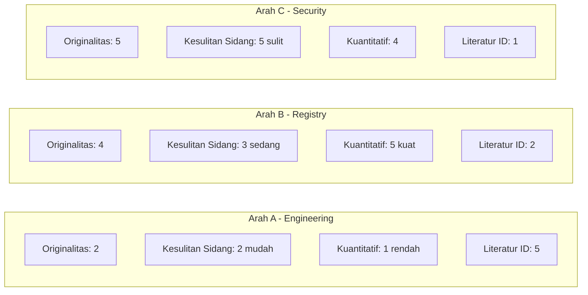
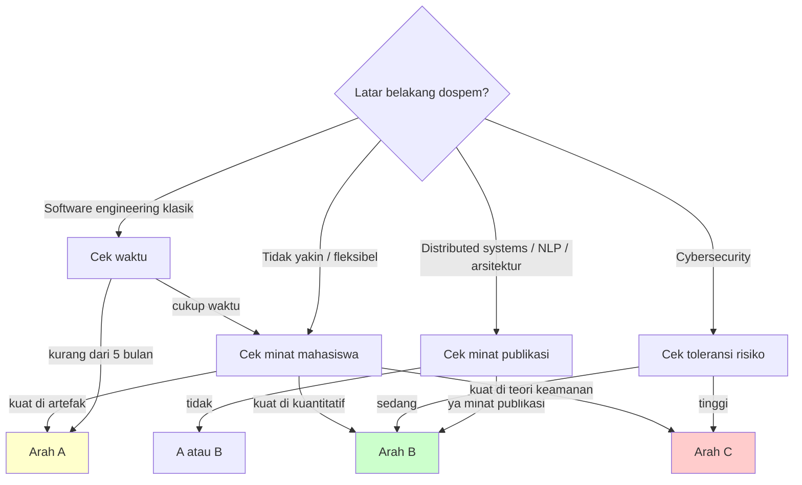

# Perbandingan Tiga Arah Tugas Akhir — Basis Keputusan untuk Diskusi dengan Dosen Pembimbing

> Dokumen ini menyajikan perbandingan komprehensif tiga arah Tugas Akhir
> yang sedang dipertimbangkan mahasiswa, lengkap dengan tabel skoring,
> analisis kekuatan-kelemahan, skenario pemilihan, dan **rekomendasi
> tegas** dari mahasiswa. Dokumen ini dimaksudkan menjadi bahan diskusi
> Zoom dengan dosen pembimbing.

---

## Daftar Isi

1. [Ringkasan Singkat Tiga Arah](#1-ringkasan-singkat-tiga-arah)
2. [Tabel Komparasi Komprehensif](#2-tabel-komparasi-komprehensif)
3. [Analisis Kekuatan dan Kelemahan](#3-analisis-kekuatan-dan-kelemahan)
4. [Skenario Kapan Memilih X](#4-skenario-kapan-memilih-x)
5. [Rekomendasi Mahasiswa](#5-rekomendasi-mahasiswa)
6. [Plan B](#6-plan-b)
7. [Pertanyaan untuk Dosen Pembimbing](#7-pertanyaan-untuk-dosen-pembimbing)
8. [Kesimpulan](#8-kesimpulan)

---

## 1. Ringkasan Singkat Tiga Arah

### Arah A — Engineering / Rancang Bangun (Konservatif)

**Judul indikatif**: *"Rancang Bangun Sistem Enterprise Resource Planning
Berbasis Modular Monolith dengan AI Agent untuk Usaha Mikro, Kecil, dan
Menengah Sektor Kuliner: Studi Kasus zerlo.id"*

**Sudut pandang**: Pengembangan perangkat lunak. Mahasiswa menjelaskan
proses rancang bangun ERP ber-AI dari analisis kebutuhan hingga
*deployment*. Kontribusi: **artefak perangkat lunak**.

### Arah B — Tool Registry & Multi-Agent Orchestration (Rekomendasi Utama)

**Judul indikatif**: *"Perancangan dan Evaluasi Tool Registry dan Multi-
Agent Orchestration untuk Sistem AI Agent Berbasis Pydantic AI pada
Platform ERP Multi-Tenant zerlo.id"*

**Sudut pandang**: Skalabilitas arsitektur AI Agent. Mahasiswa membandingkan
pola *decorator-bound tool* dengan *registry-based tool*, dan
mengevaluasi efisiensi *token*, *latency*, serta *accuracy* sebelum dan
sesudah migrasi ke *registry*. Kontribusi: **kuantitatif**.

### Arah C — Security / Defense-in-Depth Prompt Injection

**Judul indikatif**: *"Analisis dan Implementasi Pertahanan Berlapis
terhadap Prompt Injection pada Sistem AI Agent Multi-Tenant Berbasis
Pydantic AI di Platform zerlo.id"*

**Sudut pandang**: Keamanan aplikasi LLM. Mahasiswa merancang dan
mengevaluasi *defense-in-depth* sembilan lapisan + *adversarial corpus*.
Kontribusi: **model keamanan + korpus uji**.

---

## 2. Tabel Komparasi Komprehensif

| Aspek | Arah A — Engineering | Arah B — Tool Registry | Arah C — Security |
|-------|----------------------|------------------------|-------------------|
| Sudut pandang utama | Rancang bangun perangkat lunak | Skalabilitas arsitektur AI Agent | Keamanan aplikasi LLM |
| Tipe kontribusi | Artefak (sistem ERP jadi) | Kuantitatif (token, latency, accuracy) | Model keamanan + adversarial corpus |
| Originalitas (1-5) | 2 | 4 | 5 |
| Tingkat kesulitan implementasi (1-5) | 3 | 4 | 4 |
| Tingkat kesulitan dipertahankan di sidang S1 (1-5) | 2 | 3 | 5 |
| Kesesuaian kurikulum SI (1-5) | 5 | 4 | 3 |
| Ketersediaan literatur Bahasa Indonesia (1-5) | 5 | 2 | 1 |
| Kebutuhan pengujian kuantitatif | Rendah | **Tinggi** | Tinggi |
| Risiko penolakan oleh penguji | Rendah | Sedang | **Tinggi** |
| Estimasi waktu pengerjaan (bulan) | 5 | 6 | 7 |
| Kesiapan project saat ini (% sudah ter-implement) | 95% | 90% | 80% |
| Bahan empiris yang sudah ada | Modul lengkap, 1.176 endpoint, 38 modul | Phase E.5 (registry) + F-H (orchestration) ter-ship; design doc lengkap | Phase G-prompts + G-memory ter-ship; rule files lengkap |
| Gap yang perlu dikerjakan | Penulisan + diagram UML | Eksperimen *ablation* token+latency, korpus *eval* | Korpus adversarial 80+, *ablation study*, *red-team simulation* |
| Kemungkinan publikasi jurnal/seminar | Rendah | **Sedang–Tinggi** | Sedang |
| Cocok untuk dospem tipe | Klasik / *software engineering* | Riset / *distributed systems* / NLP | Riset / *cybersecurity* |
| Akses ke supervisor industri | Mudah (tim zerlo.id) | Mudah (tim zerlo.id) | Mudah (tim zerlo.id) |
| Skor Total Daya Tarik (perkiraan) | 14/25 | **20/25** | 17/25 |

### Visualisasi Skoring Per Aspek

### Skor Komposit (skala 1–5; bobot setara)

| Indikator | A | B | C |
|-----------|---|---|---|
| Originalitas | 2 | 4 | 5 |
| Kekuatan Bab 4 (kuantitatif) | 2 | 5 | 4 |
| Keamanan dipertahankan sidang | 5 | 4 | 2 |
| Kesesuaian SI | 5 | 4 | 3 |
| Kesiapan empiris saat ini | 5 | 5 | 4 |
| **Total** | **19** | **22** | **18** |

---

## 3. Analisis Kekuatan dan Kelemahan

### 3.1 Arah A — Engineering / Rancang Bangun

#### Kekuatan

1. **Risiko terendah**. Pola "rancang bangun sistem" sangat dikenal
   penguji program studi Sistem Informasi.
2. **Bahan paling siap**. zerlo.id sudah memiliki 38 modul, 1.176
   *endpoint*, 1.626 *service method*; tinggal didokumentasikan.
3. **Literatur paling banyak**. Banyak skripsi sebelumnya membahas
   *modular monolith* dan ERP UMKM dalam Bahasa Indonesia.
4. **Diagram UML lengkap** mudah dibuat: *use case*, *class*, *sequence*,
   *deployment* — semuanya cocok dengan kurikulum SI.

#### Kelemahan

1. **Originalitas rendah**. Skripsi serupa banyak — sulit menonjol.
2. **Bab 4 lemah**. Karena kontribusi berupa artefak, Bab 4 cenderung
   berisi *screenshot* aplikasi tanpa data kuantitatif yang kuat.
3. **Sulit dipublikasi** sebagai *paper*.
4. **Tidak memanfaatkan keunikan zerlo.id** — fakta bahwa platform ini
   menggunakan 11 *agent* AI menjadi sekadar *fitur* daripada inti
   kontribusi.

### 3.2 Arah B — Tool Registry & Multi-Agent Orchestration

#### Kekuatan

1. **Kontribusi terukur**. *Tool Registry* mengubah cara *agent*
   memanggil *tool* dan memungkinkan eksperimen kuantitatif:
   - Pengurangan *token usage* per giliran (perbandingan *decorator
     binding* vs *registry-based budget cap*).
   - Pengurangan *latency* p95 per *agent.run()*.
   - Peningkatan *tool selection accuracy* berkat *priority sort*
     `read > analytical > write > admin`.
2. **Bahan empiris ter-ship**. Phase E.5 sudah live; Phase F (Shift +
   Intelligence Layer), G-rag, G-memory, H-handoff, H-graphs juga sudah
   ter-ship. Tinggal dijalankan eksperimen.
3. **Design document lengkap**. `tool-registry-design.md` di repository
   sudah mencakup *rationale*, alternatif, dan *trade-off* — basis Bab 2
   dan Bab 3 sudah tersedia.
4. **Kontemporer 2025–2026**. Pola *multi-agent orchestration* sedang
   berkembang dalam literatur (paper *Multi-Agent Collaboration*, *Agent
   Workflow Memory*) — relevan tapi tidak terlalu eksotis.
5. **Skor Bab 4 tinggi**. Tabel-tabel pengukuran *token*, *latency*,
   *accuracy* sebelum/sesudah migrasi memberi konten substantif untuk
   Bab 4.
6. **Berpotensi publikasi**. Cocok untuk seminar nasional bidang
   informatika atau jurnal tingkat 4 / 5.

#### Kelemahan

1. **Istilah baru bagi sebagian dosen**. "Pydantic AI", "tool registry",
   "agent orchestration" mungkin belum dikenal — perlu *one-pager*
   pengantar.
2. **Sulit jika dosen tidak terbiasa NLP / distributed systems**. Pilih
   dosen pembimbing yang relevan.
3. **Eksperimen membutuhkan pengaturan teliti**. Harus ada kontrol
   variabel: model LLM tetap, *prompt* tetap, *seed* tetap.

### 3.3 Arah C — Security / Defense-in-Depth

#### Kekuatan

1. **Originalitas tertinggi**. Topik *prompt injection* dalam konteks
   Bahasa Indonesia hampir tidak ada penelitian sebelumnya.
2. **Korpus adversarial 80+ entri** menjadi *deliverable* sekunder
   bernilai akademik.
3. **Berkaitan langsung dengan OWASP Top 10 for LLM Apps** — referensi
   industri yang kuat.
4. **Mendukung *paper* bidang *cybersecurity***.

#### Kelemahan

1. **Risiko penolakan tertinggi**. Penguji mungkin meragukan apakah
   topik termasuk Sistem Informasi atau lebih cocok di Teknik Komputer.
2. **Literatur Bahasa Indonesia sangat minim**. Bab 2 lebih sulit ditulis.
3. **Hasil sulit di-*generalize*** — *single platform*, kemungkinan
   diminta *cross-platform comparison*.
4. **Etika *red-teaming*** perlu pengelolaan ekstra — tenant uji,
   *environment* terpisah, persetujuan tertulis.
5. **Waktu paling lama** (7 bulan).

---

## 4. Skenario Kapan Memilih X

### Pilih Arah A apabila:

- Dosen pembimbing menyukai pola "rancang bangun" klasik.
- Mahasiswa ingin **risiko sidang serendah mungkin**.
- Waktu yang tersedia ≤ 5 bulan.
- Tujuan utama hanya **lulus**, bukan publikasi.

### Pilih Arah B apabila:

- Dosen pembimbing memiliki latar belakang riset *distributed systems*,
  NLP, atau *software architecture*.
- Mahasiswa ingin **Bab 4 yang substantif** dengan data kuantitatif
  (tabel *token*, *latency*, *accuracy*).
- Mahasiswa membuka kemungkinan **publikasi seminar nasional**.
- Tersedia waktu 6 bulan.
- Mahasiswa nyaman dengan istilah teknis modern (Pydantic AI,
  *multi-agent orchestration*).

### Pilih Arah C apabila:

- Dosen pembimbing memiliki latar belakang *cybersecurity* atau *secure
  software engineering*.
- Mahasiswa siap menulis Bab 2 yang panjang dari sumber Bahasa Inggris.
- Tersedia waktu 7 bulan.
- Mahasiswa siap menjawab pertanyaan kritis "apakah ini ranah Sistem
  Informasi?" dengan argumen *risk management* dan *security architecture*.

### Decision Tree

---

## 5. Rekomendasi Mahasiswa

> **Mahasiswa merekomendasikan Arah B — Tool Registry & Multi-Agent
> Orchestration** sebagai arah utama Tugas Akhir.

Argumen:

### 5.1 Kontribusi Terukur Secara Kuantitatif

Arah B mempunyai keluaran kuantitatif yang dapat ditampilkan dalam tabel
dan grafik Bab 4:

- **Pengurangan token per giliran**: *registry budget cap* memilih
  maksimum 15 *tool* dengan urutan prioritas
  `read > analytical > write > admin`. Eksperimen *before/after*
  mengukur penghematan *token*.
- **Pengurangan latency p95**: `agent.run()` lebih cepat karena LLM
  tidak harus memilih dari ratusan *tool*.
- **Peningkatan accuracy tool selection**: *evaluation harness*
  membandingkan *tool* yang dipilih LLM dengan *ground truth*.
- **Reduction *cross-agent code duplication***: garis-line *count*
  sebelum vs sesudah migrasi.

### 5.2 Project Sudah Ship Phase E.5 dan H-Graphs

Bahan empiris siap pakai. Mahasiswa adalah *engineer* utama; akses ke
basis kode + *log* + *trace* lengkap. Phase yang sudah *live*:

| Phase | Konten | Relevansi terhadap Arah B |
|-------|--------|---------------------------|
| E.5 | Tool Registry foundation | Inti penelitian |
| F | Shift Scheduling + Intelligence Layer | Konsumen registry |
| G-memory | Long-term agent memory + vector store | Modul yang menambah tool |
| G-rag | RAG knowledge base | Modul yang menambah tool |
| H-handoff | Programmatic agent hand-off | Orchestration multi-agent |
| H-graphs | Pydantic-graph workflow | Orchestration multi-agent |

### 5.3 Kontemporer Tetapi Tidak Eksotis

Topik *multi-agent orchestration* sedang muncul di literatur 2024–2026
(AutoGen, LangGraph, Pydantic Graph), tetapi pola dasar (*registry*,
*budget cap*, *priority sort*) sudah dikenal di *systems engineering*
sejak lama. Penguji tidak akan merasa terlalu asing.

### 5.4 Design Document Sudah Ada

File `tool-registry-design.md` di repository memuat:

- Latar belakang masalah
- Alternatif yang dipertimbangkan
- *Trade-off* desain
- Pseudokode

Dokumen ini menjadi basis Bab 2 dan Bab 3 — mengurangi waktu penulisan
secara signifikan.

### 5.5 Risiko Penolakan Moderat

- Lebih aman dari Arah C (yang berpotensi ditolak karena dianggap di
  luar SI).
- Lebih original dari Arah A (yang berpotensi ditolak karena terlalu
  generik).

### 5.6 Skor Komposit Tertinggi

Pada Tabel Skor Komposit, Arah B memperoleh **22/25**, sementara Arah A
**19/25** dan Arah C **18/25**.

---

## 6. Plan B

Apabila dosen pembimbing **menolak Arah B** dengan alasan apa pun
(misalnya istilah terlalu teknis atau merasa tidak menguasai *multi-agent
orchestration*), mahasiswa akan **fallback ke Arah A**.

### Alasan Fallback ke Arah A (bukan ke Arah C)

1. Arah A memiliki **risiko penolakan paling rendah** dan kemungkinan
   besar disetujui dengan revisi minor.
2. Materi rancang bangun siap pakai; mahasiswa tidak perlu mengerjakan
   eksperimen yang berat.
3. Arah C masih membawa risiko penolakan tinggi dari penguji
   (lebih besar dari risiko Arah A).

### Strategi Negosiasi

1. Tawarkan Arah B terlebih dahulu; siapkan *one-pager* ringkas.
2. Jika dosen ragu, tawarkan **Arah A dengan satu sudut Arah B** —
   misalnya:
   *"Rancang Bangun ERP dengan AI Agent ... dan Evaluasi Performa
   Arsitektur Tool Registry"*.
   Bab 4 sebagian berisi *screenshot* (gaya A), sebagian berisi tabel
   kuantitatif (gaya B).
3. Arah C disimpan sebagai *future work* di Bab 5.

---

## 7. Pertanyaan untuk Dosen Pembimbing

Berikut *teaser* pertanyaan kunci untuk diajukan saat Zoom. Daftar
lengkap berserta argumen pendukung berada di file terpisah
`05-pertanyaan-untuk-dospem.md`.

1. Apakah Bapak/Ibu memandang topik **multi-agent AI orchestration**
   masih relevan dalam ranah Sistem Informasi, atau sebaiknya digeser ke
   ranah perancangan perangkat lunak?
2. Untuk Bab 4 yang kuat, apakah Bapak/Ibu lebih menyukai pendekatan
   **artefak** (Arah A) atau **kuantitatif** (Arah B / C)?
3. Apakah Bapak/Ibu nyaman dengan istilah **Pydantic AI**, **tool
   registry**, dan **agent hand-off**? Jika tidak, apakah saya perlu
   menyiapkan *one-pager* pengantar?
4. Bagaimana penilaian Bapak/Ibu terhadap **risiko penolakan penguji**
   pada arah Security (Arah C)?
5. Apakah Bapak/Ibu bersedia mendampingi Tugas Akhir yang berorientasi
   **publikasi seminar nasional**? Apabila ya, manakah arah yang paling
   sesuai?
6. Berapa **lama** waktu yang Bapak/Ibu ekspektasikan untuk Tugas Akhir
   ini?
7. Apakah ada **persyaratan tambahan** dari program studi (misal
   *paper*, *poster*) yang perlu dipertimbangkan?

> Catatan: file `05-pertanyaan-untuk-dospem.md` (akan dibuat terpisah)
> berisi versi lengkap dengan argumen pendukung tiap pertanyaan dan
> kemungkinan jawaban.

---

## 8. Kesimpulan

Tiga arah Tugas Akhir telah dianalisis secara komprehensif. **Arah B —
Tool Registry & Multi-Agent Orchestration** menempati posisi paling
seimbang antara originalitas, kekuatan kuantitatif, dan tingkat risiko
sidang. Arah ini memanfaatkan keunikan platform zerlo.id sebagai sistem
AI Agent multi-tenant *production-grade*, dengan *deliverable* yang
sudah *ter-ship* sehingga eksperimen dapat segera dimulai.

**Rekomendasi akhir mahasiswa**:

1. Ajukan **Arah B** sebagai prioritas utama.
2. Apabila ditolak, *fallback* ke **Arah A**.
3. **Arah C** disimpan sebagai *future work* atau alternatif jika dosen
   pembimbing kebetulan berlatar belakang *cybersecurity* dan menyukai
   tantangan.

Keputusan akhir ada pada dosen pembimbing. Dokumen ini, beserta dua
dokumen pelengkap (`02-kandidat-judul-B-tool-registry.md` dan
`03-kandidat-judul-C-security.md`), diharapkan menjadi basis diskusi
yang produktif.

---

## Lampiran — Tautan Dokumen Pendukung

| File | Isi |
|------|-----|
| `01-kandidat-judul-A-engineering.md` | Detail Arah A |
| `02-kandidat-judul-B-tool-registry.md` | Detail Arah B (rekomendasi utama) |
| `03-kandidat-judul-C-security.md` | Detail Arah C |
| `04-perbandingan-3-arah.md` | Dokumen ini |
| `05-pertanyaan-untuk-dospem.md` | Daftar pertanyaan lengkap untuk Zoom |
