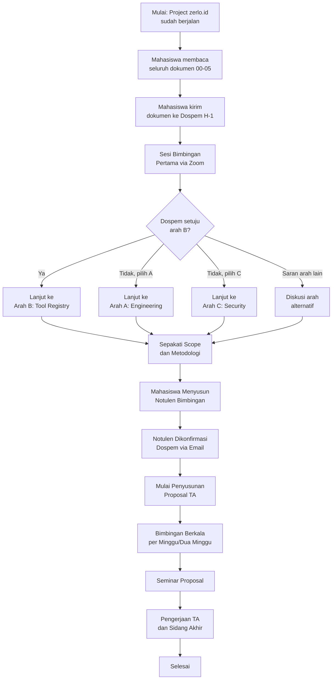

# Persiapan Tugas Akhir — zerlo.id

**Tanggal Pembuatan**: 2 Mei 2026
**Versi Dokumen**: 1.0
**Status**: Draft untuk Bimbingan

---

## Identitas Mahasiswa

| Atribut | Nilai |
|---------|-------|
| Nama Mahasiswa | Muhammad Ridwan |
| NIM | 220101010009 |
| Program Studi | PJJ Sistem Informasi |
| Perguruan Tinggi | Universitas Siber Asia |
| Dosen Pembimbing | Ikhwani Saputra, S.Kom., M.Kom |
| Semester | 8 |
| Email | ridwanspace.dotcom@gmail.com |

---

## 1. Tujuan Folder Ini

Folder `tugas-akhir/` ini berisi seluruh dokumen persiapan Tugas Akhir
yang berfokus pada project **zerlo.id** — sebuah sistem ERP berbasis
kecerdasan buatan untuk Usaha Mikro, Kecil, dan Menengah (UMKM)
sektor Food and Beverage di Indonesia. Folder ini disusun untuk dua
audiens utama: dosen pembimbing yang akan mengevaluasi dan menyetujui
arah Tugas Akhir, serta mahasiswa sendiri sebagai panduan kerja.

Tujuan akhir dari penyusunan dokumen-dokumen ini adalah memperoleh
keputusan tegas dari dosen pembimbing terkait tiga hal: (1) arah
judul yang disetujui, (2) ruang lingkup yang disepakati, dan (3)
metodologi penelitian yang akan digunakan. Dengan ketiga keputusan
tersebut, proses penyusunan proposal Tugas Akhir dapat segera
dimulai.

---

## 2. Daftar File

| No | File | Isi Singkat | Audiens Utama | Estimasi Baca |
|----|------|-------------|---------------|---------------|
| 0 | `README.md` | Index navigasi dan panduan baca | Dospem dan Mahasiswa | 5 menit |
| 1 | `00-ringkasan-project-zerlo.md` | Overview project zerlo.id, stack teknologi, fitur utama | Dospem dan Mahasiswa | 15 menit |
| 2 | `01-kandidat-judul-A-engineering.md` | Arah A — Rancang Bangun Sistem (umum, aman) | Dospem | 20 menit |
| 3 | `02-kandidat-judul-B-tool-registry.md` | Arah B — Tool Registry dan Multi-Agent (rekomendasi utama) | Dospem dan Mahasiswa | 25 menit |
| 4 | `03-kandidat-judul-C-security.md` | Arah C — Security dan Prompt Injection Defense | Dospem | 20 menit |
| 5 | `04-perbandingan-3-arah.md` | Komparasi tiga arah dan rekomendasi tegas | Dospem dan Mahasiswa | 15 menit |
| 6 | `05-pertanyaan-untuk-dospem.md` | Daftar pertanyaan terstruktur untuk sesi bimbingan | Mahasiswa | 10 menit |

**Total estimasi waktu baca**: sekitar 110 menit untuk pembacaan
lengkap, atau 60 menit untuk pembacaan selektif sesuai urutan yang
disarankan di Section 3.

---

## 3. Urutan Baca yang Disarankan

Urutan baca berbeda antara dosen pembimbing dan mahasiswa karena
masing-masing memiliki kebutuhan informasi yang berbeda.

### 3.1. Untuk Dosen Pembimbing

Urutan ini dirancang agar dosen pembimbing dapat dengan cepat
memahami konteks dan langsung fokus pada keputusan strategis.

1. **README.md** — memahami struktur folder dan tujuan dokumen
2. **00-ringkasan-project-zerlo.md** — memahami konteks project
3. **04-perbandingan-3-arah.md** — melihat ringkasan tiga arah
4. **01, 02, atau 03** — membaca detail arah sesuai minat dan
   kesesuaian bidang dospem (boleh dibaca selektif, tidak wajib
   ketiganya)
5. **05-pertanyaan-untuk-dospem.md** — melihat daftar pertanyaan
   yang akan diajukan mahasiswa

**Estimasi waktu untuk dospem**: 45-60 menit (pembacaan selektif).

### 3.2. Untuk Mahasiswa

Urutan ini dirancang agar mahasiswa memiliki pemahaman menyeluruh
sebelum sesi bimbingan.

1. **00-ringkasan-project-zerlo.md** — pemantapan konteks project
2. **01-kandidat-judul-A-engineering.md** — memahami opsi paling aman
3. **02-kandidat-judul-B-tool-registry.md** — memahami opsi
   rekomendasi utama
4. **03-kandidat-judul-C-security.md** — memahami opsi paling
   kontemporer
5. **04-perbandingan-3-arah.md** — menyusun argumen pemilihan
6. **05-pertanyaan-untuk-dospem.md** — persiapan akhir sebelum
   bimbingan

**Estimasi waktu untuk mahasiswa**: sekitar 110 menit (pembacaan
lengkap, dianjurkan dilakukan dua hingga tiga hari sebelum
bimbingan).

---

## 4. Ringkasan Tiga Arah Kandidat Tugas Akhir

Berikut adalah ringkasan singkat dari ketiga arah kandidat. Detail
masing-masing arah dapat dibaca pada file 01, 02, dan 03.

### 4.1. Arah A — Rancang Bangun Sistem (Engineering)

Arah ini mengusung topik klasik Rekayasa Perangkat Lunak: rancang
bangun sistem ERP untuk UMKM sektor Food and Beverage. Pendekatan
yang digunakan adalah deskriptif rancang bangun dengan metodologi
SDLC konvensional. Arah ini paling aman dari sisi metodologi dan
familiar bagi sebagian besar dosen pembimbing, namun cenderung
kurang menonjolkan keunggulan teknis dari project zerlo.id.

### 4.2. Arah B — Tool Registry dan Multi-Agent Architecture

Arah ini berfokus pada kontribusi orisinal terhadap pola arsitektur
multi-agen, khususnya pada pola **Tool Registry** yang dikembangkan
secara mandiri oleh mahasiswa pada project zerlo.id. Pendekatan
yang digunakan adalah eksperimen kuantitatif dengan metrik token
consumption, latency, dan accuracy. Arah ini menawarkan kontribusi
ilmiah yang lebih tinggi dan sesuai dengan tren penelitian terkini
di bidang Large Language Model.

### 4.3. Arah C — Security dan Prompt Injection Defense

Arah ini berfokus pada perancangan dan evaluasi sistem pertahanan
berlapis (defense-in-depth) terhadap serangan prompt injection
pada arsitektur multi-agen. Pendekatan yang digunakan adalah
eksperimen adversarial dengan corpus serangan terstruktur. Arah
ini paling kontemporer dan relevan dengan isu keamanan AI, namun
memiliki risiko etika dan kompleksitas eksperimen yang lebih
tinggi.

### 4.4. Rekomendasi Tegas

**Mahasiswa merekomendasikan Arah B sebagai pilihan utama.**
Alasannya, Arah B menawarkan keseimbangan optimal antara tiga
faktor: (1) kontribusi ilmiah yang terukur secara kuantitatif
melalui metrik token, latency, dan accuracy, (2) ketersediaan
data eksperimen yang sudah ada karena project zerlo.id sudah
berjalan dalam tahap beta testing, dan (3) kesesuaian dengan
kompetensi mahasiswa sebagai developer utama project tersebut.
Pola Tool Registry yang dikembangkan pada project ini juga
merupakan kontribusi orisinal yang dapat dipublikasikan, sehingga
membuka peluang pengembangan menjadi paper jurnal di masa depan.
Detail argumen lengkap dapat dilihat pada file
`04-perbandingan-3-arah.md`.

---

## 5. Konteks Project zerlo.id

zerlo.id adalah sistem Enterprise Resource Planning berbasis AI
yang dirancang khusus untuk UMKM sektor Food and Beverage di
Indonesia. Sistem ini saat ini berada dalam tahap beta testing
dan dibangun dengan stack FastAPI sebagai backend, Pydantic AI
versi 1.83.0 sebagai framework agen, MongoDB Atlas sebagai
database utama, dan Google Cloud Platform sebagai infrastruktur
deployment. Arsitektur sistem mengadopsi pola Modular Monolith
dengan Clean Architecture, terdiri dari sebelas agen AI dan tiga
puluh delapan modul fungsional yang mencakup Point of Sale,
Inventory, Accounting, Supplier Management, dan modul-modul
pendukung lainnya. Detail lengkap project dapat dibaca pada file
`00-ringkasan-project-zerlo.md`.

---

## 6. Apa yang Dibutuhkan dari Dosen Pembimbing

Berikut adalah daftar konkret hal-hal yang diharapkan dari dosen
pembimbing pada sesi bimbingan pertama dan sesi-sesi berikutnya.

- **Persetujuan arah judul** — keputusan final terkait apakah
  Arah A, B, atau C yang akan diambil, atau apakah ada arah
  alternatif yang lebih sesuai
- **Masukan terkait ruang lingkup** — penetapan batasan jumlah
  agen, modul, dan fitur yang akan dibahas dalam Tugas Akhir
- **Persetujuan metodologi penelitian** — penetapan pendekatan
  ilmiah (kualitatif, kuantitatif, atau kombinasi) beserta
  metode pengujian yang digunakan
- **Penetapan jadwal bimbingan** — kesepakatan frekuensi,
  format, dan waktu bimbingan yang akan datang
- **Format draft yang diharapkan** — kesepakatan format
  pengiriman draft (per-bab atau lengkap) dan format file
  (Markdown, Word, atau PDF)
- **Lead time review** — informasi terkait estimasi waktu
  review yang dibutuhkan dospem untuk memberi feedback
- **Persetujuan tertulis judul** — bila memungkinkan, tanda
  tangan digital atau persetujuan via email sebagai bukti
  formal sebelum pengajuan ke akademik

---

## 7. Status Dokumen

| Atribut | Nilai |
|---------|-------|
| Versi | 1.0 |
| Tanggal | 2 Mei 2026 |
| Status | Draft untuk Bimbingan |
| Penulis | [Nama Mahasiswa] |
| Reviewer | [Nama Dosen Pembimbing] |
| Tanggal Review Terakhir | — (belum direview) |
| Tanggal Persetujuan | — (belum disetujui) |

Dokumen-dokumen di folder ini akan diperbarui secara berkala
sesuai dengan masukan dosen pembimbing. Setiap pembaruan akan
disertai penambahan nomor versi (1.1, 1.2, dan seterusnya) dan
catatan changelog di bagian atas masing-masing file.

---

## 8. Cara Update File

Berikut adalah panduan singkat untuk mahasiswa dalam memperbarui
file-file di folder ini.

1. **Edit file di lokal** — gunakan editor Markdown pilihan
   (Visual Studio Code, Obsidian, atau lainnya) untuk
   mengedit file
2. **Update versi di header file** — naikkan nomor versi dan
   tambahkan tanggal pembaruan di bagian atas file yang diedit
3. **Tambahkan catatan changelog** — tuliskan ringkasan
   perubahan di bagian akhir file dengan format
   "Versi 1.x — Tanggal — Ringkasan perubahan"
4. **Commit ke git lokal** — gunakan commit message yang jelas,
   misalnya "docs(ta): update file 02 berdasar masukan dospem"
5. **Konversi ke PDF** — sebelum dikirim ke dospem, konversi
   seluruh file Markdown ke PDF menggunakan tool seperti pandoc
   atau ekstensi VS Code
6. **Kirim ke dospem** — kirim PDF (atau zip berisi seluruh
   PDF) ke dospem via email dengan subject yang jelas, minimal
   H-1 sebelum sesi bimbingan
7. **Backup di cloud** — simpan salinan di Google Drive atau
   penyimpanan cloud lain sebagai backup

---

## 9. Diagram Alur Pemilihan Judul Tugas Akhir

Diagram berikut menggambarkan alur pemilihan judul Tugas Akhir
dari tahap persiapan hingga penyusunan proposal.

Diagram di atas menunjukkan bahwa keputusan kunci (arah judul,
scope, metodologi) ditetapkan pada sesi bimbingan pertama,
kemudian dilanjutkan dengan siklus bimbingan berkala hingga
seminar proposal dan sidang akhir.

---

## 10. Kontak dan Catatan

Berikut adalah informasi kontak yang relevan. Mahasiswa wajib
mengisi placeholder di bawah ini sebelum mengirim folder ini
ke dosen pembimbing.

### 10.1. Mahasiswa

- **Nama**: [Nama Mahasiswa]
- **NIM**: [NIM]
- **Email**: [email mahasiswa]
- **Nomor WhatsApp**: [nomor WA]
- **GitHub**: [username GitHub]

### 10.2. Dosen Pembimbing

- **Nama**: [Nama Dosen Pembimbing, lengkap dengan gelar]
- **Email**: [email dospem]
- **Nomor Kontak**: [bila diberikan]

### 10.3. Link Bimbingan

- **Link Zoom**: [link Zoom yang disepakati]
- **Meeting ID**: [meeting ID]
- **Passcode**: [passcode]

### 10.4. Catatan Tambahan

> Bagian ini dapat diisi mahasiswa dengan catatan tambahan
> yang relevan, misalnya nomor SK pembimbing, kode mata
> kuliah Tugas Akhir, atau informasi administratif lainnya.
>
> ____________________________________________________
>
> ____________________________________________________

---

## 11. Changelog

| Versi | Tanggal | Perubahan |
|-------|---------|-----------|
| 1.0 | 2 Mei 2026 | Versi awal dokumen, draft untuk bimbingan pertama |

---

**Akhir Dokumen**

Dokumen ini akan terus diperbarui mengikuti perkembangan proses
bimbingan dan penyusunan Tugas Akhir. Mahasiswa diharapkan
membaca ulang dokumen ini sebelum setiap sesi bimbingan untuk
memastikan konsistensi pemahaman dengan dosen pembimbing.
