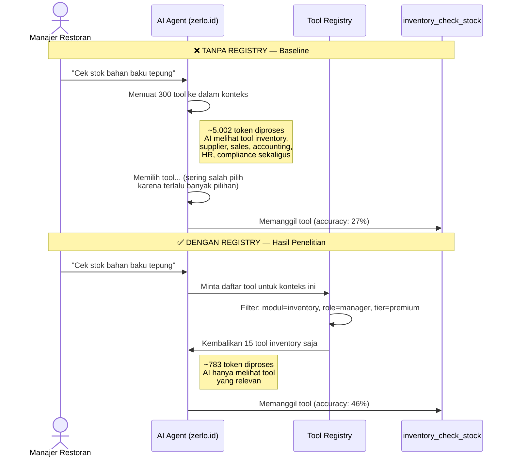
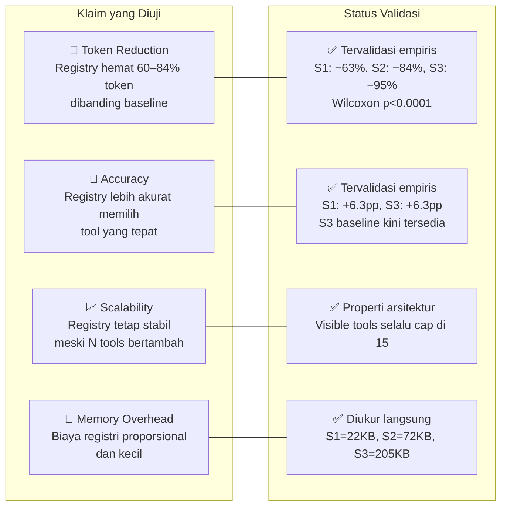
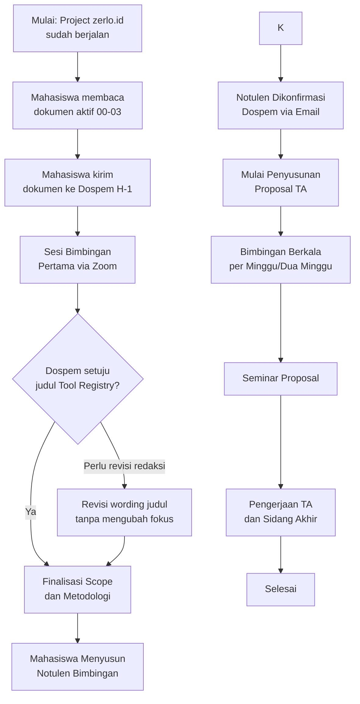

# Persiapan Tugas Akhir — zerlo.id

<!-- Status -->


<!-- Experiment stack -->


<!-- zerlo.id production stack -->


<!-- Experiment results -->


**Tanggal Pembuatan**: 2 Mei 2026
**Versi Dokumen**: 1.6
**Status**: Multi-model comparison in progress — Gemini Native v2 (official, n=558) + MiniMax-M2.7 (S1–S2 selesai) + Claude Sonnet 4.6 (direncanakan)

---

## Identitas Mahasiswa

| Atribut | Nilai |
|---------|-------|
| Nama Mahasiswa | Muhammad Ridwan |
| NIM | 220101010009 |
| Program Studi | PJJ Sistem Informasi |
| Perguruan Tinggi | Universitas Siber Asia |
| Dosen Pembimbing | Ikhwani Saputra, S.Kom., M.Kom |
| Semester | 8 |
| Email | ridwanspace.dotcom@gmail.com |

---

## 1. Tujuan Folder Ini

Folder `tugas-akhir/` ini berisi seluruh dokumen persiapan Tugas Akhir
yang berfokus pada project **zerlo.id** — sebuah sistem ERP berbasis
kecerdasan buatan untuk Usaha Mikro, Kecil, dan Menengah (UMKM)
sektor Food and Beverage di Indonesia. Folder ini disusun untuk dua
audiens utama: dosen pembimbing yang akan mengevaluasi dan menyetujui
arah Tugas Akhir, serta mahasiswa sendiri sebagai panduan kerja.

Tujuan akhir dari penyusunan dokumen-dokumen ini adalah memperoleh
keputusan tegas dari dosen pembimbing terkait tiga hal: (1) arah
judul yang disetujui, (2) ruang lingkup yang disepakati, dan (3)
metodologi penelitian yang akan digunakan. Dengan ketiga keputusan
tersebut, proses penyusunan proposal Tugas Akhir dapat segera
dimulai.

---

## 1b. Apa yang Kami Teliti — Masalah, Solusi, dan Kontribusi

### Masalah: AI Agent Kewalahan Saat Jumlah Tool Bertambah

zerlo.id adalah sistem ERP restoran berbasis AI. Sistem ini memiliki
banyak **tool** — yaitu fungsi-fungsi bisnis yang bisa dipanggil oleh
AI Agent, seperti "cek stok bahan baku", "buat laporan penjualan", atau
"generate jurnal akuntansi". Saat ini ada lebih dari 60 tool aktif, dan
jumlah ini terus bertambah seiring perkembangan fitur ERP.

**Masalahnya**: setiap kali pengguna mengajukan pertanyaan, AI Agent
harus *melihat semua tool sekaligus* sebelum bisa memilih satu yang
tepat. Bayangkan seperti seorang kasir yang setiap menerima pesanan
harus membaca ulang seluruh 300 item menu — termasuk menu yang tidak
tersedia hari ini — sebelum bisa menjawab "mau pesan apa?". Semakin
banyak tool, semakin sering AI salah pilih, semakin banyak biaya komputasi
(token), dan semakin lambat respons.

```
KONDISI TANPA TOOL REGISTRY
─────────────────────────────────────────────────────────────────
 Pertanyaan pengguna ──► AI Agent ──► Melihat SEMUA 300 tool
                                       ├─ inventory_check_stock
                                       ├─ inventory_admin_tool_01
                                       ├─ inventory_admin_tool_02
                                       ├─ ...
                                       ├─ sales_daily_revenue
                                       ├─ sales_analytical_tool_01
                                       ├─ accounting_generate_journal
                                       ├─ ... (290 tool lainnya)
                                       └─ compliance_check_halal_certificate
                          AI harus memproses semua ini → 5.000+ token
                          Risiko salah pilih meningkat drastis
```

### Solusi: Tool Registry — Manajer Katalog yang Cerdas

Tool Registry adalah lapisan yang berdiri **di depan AI Agent**. Sebelum
AI melihat daftar tool, Tool Registry menyaring katalog berdasarkan empat
kriteria:

1. **Modul** — permintaan tentang stok? hanya tampilkan tool inventory.
2. **Role pengguna** — kasir tidak perlu melihat tool administrasi sistem.
3. **Tier subscription** — fitur premium hanya untuk pelanggan premium.
4. **Budget token** — maksimum 15 tool per panggilan, agar tetap efisien.

Hasilnya: AI hanya melihat **10–15 tool yang paling relevan**, bukan 300.

```
KONDISI DENGAN TOOL REGISTRY
─────────────────────────────────────────────────────────────────
 Pertanyaan pengguna ──► Tool Registry ──► Filter berdasarkan:
                          │                  modul + role + tier
                          │
                          ▼
                         AI Agent ──► Hanya melihat 15 tool relevan
                                       ├─ inventory_check_stock     ← tepat
                                       ├─ inventory_read_tool_02
                                       ├─ inventory_read_tool_05
                                       └─ ... (12 tool lain)
                          AI fokus → 581 token, akurasi lebih tinggi
```

### Skenario Nyata: "Cek Stok Bahan Baku Tepung"

Berikut perbandingan langsung antara kondisi tanpa dan dengan registry
pada satu pertanyaan nyata dari zerlo.id:



### Perbandingan Kuantitatif: Sebelum vs Sesudah Registry

Berikut ringkasan hasil eksperimen nyata (Gemini API, native function
calling, S1–S3, 3 pengulangan):

```mermaid
xychart-beta
    title "Rata-rata Token per Panggilan (lebih rendah = lebih baik)"
    x-axis ["S1: 30 tools", "S2: 100 tools", "S3: 300 tools"]
    y-axis "Token" 0 --> 25000
    bar [2426, 7985, 23893]
    bar [893, 1241, 1239]
```



| Aspek | Tanpa Registry (Baseline) | Dengan Registry | Perubahan |
|-------|--------------------------|-----------------|-----------|
| Token S1 (30 tools) | 2.426 | 893 | **−63%** |
| Token S2 (100 tools) | 7.985 | 1.241 | **−84%** |
| Token S3 (300 tools) | 23.893 | 1.239 | **−95%** |
| Tool selection accuracy S1 | 68.8% | 75.0% | **+6.3pp** |
| Tool selection accuracy S2 | 71.4% | 71.4% | 0pp |
| Tool selection accuracy S3 | 71.4% | 77.6% | **+6.3pp** |
| Jumlah tool yang dilihat AI | O(N) — ikut bertambah | O(1) — selalu ≤15 | **Sub-linear** |
| Uji statistik token reduction | — | Wilcoxon p<0.0001, Cohen's d≥11 | **Signifikan** |

> **Interpretasi**: Saat katalog tool berkembang dari 30 → 100 → 300,
> token baseline melonjak linier (2K→8K→24K). Registry tetap stabil
> di ~1.240 token karena selalu hanya menampilkan 15 tool terbaik.
> Penghematan token tervalidasi secara statistik (p<0.0001) di semua skenario.

### Apa yang Ingin Dibuktikan

Penelitian ini ingin menjawab satu pertanyaan utama:

> *"Apakah Tool Registry — sebagai lapisan penyaring tool berbasis
> metadata — mampu meningkatkan efisiensi token, akurasi pemilihan
> tool, dan skalabilitas AI Agent pada sistem ERP multi-modul?"*

Empat klaim yang diuji secara kuantitatif:



### Mengapa Ini Penting untuk zerlo.id

zerlo.id saat ini memiliki 38 modul, 1.176 endpoint, dan terus berkembang.
Tanpa Tool Registry, setiap penambahan modul baru langsung memperberat semua
AI Agent secara proporsional. Dengan Tool Registry, penambahan modul baru
*tidak menambah beban per panggilan* — AI tetap hanya melihat 15 tool relevan,
tidak peduli total katalog sudah 300 atau 1.000 tool.

Ini adalah perbedaan antara sistem yang **linear** (makin besar, makin lambat
dan tidak akurat) versus sistem yang **sub-linear** (makin besar, beban per
panggilan tetap).

---

## 2. Daftar File Aktif

| No | File | Isi Singkat | Audiens Utama | Estimasi Baca |
|----|------|-------------|---------------|---------------|
| 0 | `README.md` | Index navigasi dan panduan baca | Dospem dan Mahasiswa | 5 menit |
| 1 | `00-ringkasan-project-zerlo.md` | Overview project zerlo.id, stack teknologi, fitur utama | Dospem dan Mahasiswa | 15 menit |
| 2 | `01-judul-tool-registry.md` | Detail judul terpilih — Tool Registry untuk Skalabilitas AI Agent | Dospem dan Mahasiswa | 25 menit |
| 3 | `02-keputusan-judul-final.md` | Keputusan judul final, fokus penelitian, metrik evaluasi, temuan evaluasi | Dospem dan Mahasiswa | 10 menit |
| 4 | `03-pertanyaan-untuk-dospem.md` | Daftar pertanyaan terstruktur untuk sesi bimbingan | Mahasiswa | 10 menit |
| 5 | `plan/01-dev-plan-evaluasi-tool-registry.md` | Rencana implementasi codebase evaluasi, status aktual, dan roadmap perbaikan ilmiah | Mahasiswa | 15 menit |
| 6 | `reports/tool-registry-eval/report.md` | Laporan benchmark synthetic S1–S4 | Dospem dan Mahasiswa | 10 menit |
| 7 | `reports/tool-registry-eval-gemini-native-v2/report.md` | Laporan Gemini native FC v2 S1–S3 + failure analysis (hasil resmi) | Dospem dan Mahasiswa | 15 menit |
| 8 | `reports/tool-registry-eval-gemini-rich/report.md` | Laporan eksperimen deskripsi kaya — validasi future-work description quality | Mahasiswa | 10 menit |

Dokumen alternatif judul sebelumnya telah dipindahkan ke folder
`arsip-judul/` agar folder aktif tetap fokus pada judul yang dipilih.

---

## 3. Urutan Baca yang Disarankan

Urutan baca berbeda antara dosen pembimbing dan mahasiswa karena
masing-masing memiliki kebutuhan informasi yang berbeda.

### 3.1. Untuk Dosen Pembimbing

Urutan ini dirancang agar dosen pembimbing dapat dengan cepat
memahami konteks dan langsung fokus pada keputusan strategis.

1. **README.md** — memahami struktur folder dan tujuan dokumen
2. **00-ringkasan-project-zerlo.md** — memahami konteks project
3. **02-keputusan-judul-final.md** — melihat judul final dan alasan
   pemilihan
4. **01-judul-tool-registry.md** — membaca detail teknis,
   rumusan masalah, metodologi, dan eksperimen
5. **03-pertanyaan-untuk-dospem.md** — melihat daftar pertanyaan
   yang akan diajukan mahasiswa

**Estimasi waktu untuk dospem**: 45-60 menit (pembacaan selektif).

### 3.2. Untuk Mahasiswa

Urutan ini dirancang agar mahasiswa memiliki pemahaman menyeluruh
sebelum sesi bimbingan.

1. **00-ringkasan-project-zerlo.md** — pemantapan konteks project
2. **02-keputusan-judul-final.md** — memahami keputusan judul final
3. **01-judul-tool-registry.md** — memahami detail
   penelitian Tool Registry
4. **03-pertanyaan-untuk-dospem.md** — persiapan akhir sebelum
   bimbingan

**Estimasi waktu untuk mahasiswa**: sekitar 110 menit (pembacaan
lengkap, dianjurkan dilakukan dua hingga tiga hari sebelum
bimbingan).

---

## 3b. Status Evaluasi (per 5 Mei 2026)

Tiga set eksperimen selesai. Hasil resmi adalah eksperimen native function calling.

### Benchmark Synthetic (S1–S4, deterministik)

Sumber: `outputs/summary.csv` · Laporan: `reports/tool-registry-eval/report.md`

| Klaim | Status |
|-------|--------|
| Token reduction | ✅ Tervalidasi — aritmatika |
| Sub-linear scalability | ✅ Tervalidasi — properti arsitektur |
| Accuracy improvement | ⚠️ Simulasi dengan koefisien asumsi |
| Memory footprint | ✅ Real Python measurement |

### Eksperimen Gemini Native Function Calling v2 (S1–S3, 3 repeats, n=558) ← HASIL RESMI

Sumber: `outputs/gemini-native-v2/summary.csv` · Laporan: `reports/tool-registry-eval-gemini-native-v2/report.md`

Dataset: **100 query** (50 single-domain, 30 cross-domain, 20 adversarial). S3 baseline kini tersedia.

| Klaim | Status | Bukti Empiris |
|-------|--------|---------------|
| Token reduction | ✅ Tervalidasi + statistik | S1: −63%, S2: −84%, S3: −95%; Wilcoxon p<0.0001, Cohen's d≥11 |
| Accuracy: registry ≥ baseline | ✅ Tervalidasi | S1: +6.3pp, S3: +6.3pp; S2 sama (71.4%) |
| Sub-linear scalability | ✅ Architectural property | Visible tools S1=10.6, S2/S3=15 vs baseline O(N) |
| Memory footprint | ✅ Real Python measurement | S1=22KB, S2=72KB, S3=205KB |
| Latency improvement | ⚠️ Modest/noisy | S3 registry 851ms vs S3 baseline 992ms (−14%) |

| Skenario | Mode | Avg Tokens | Accuracy | Latency p50 (ms) |
|----------|------|------------|----------|------------------|
| S1 | baseline | 2.426 | 68.8% | 833 |
| S1 | registry | 893 | **75.0%** | 905 |
| S2 | baseline | 7.985 | 71.4% | 1.014 |
| S2 | registry | 1.241 | **71.4%** | 910 |
| S3 | baseline | 23.893 | 71.4% | 992 |
| S3 | registry | 1.239 | **77.6%** | 851 |

### Eksperimen Deskripsi Kaya / Docstring-Style (S1–S3, 3 repeats, n=156)

Sumber: `outputs/gemini-rich/summary.csv` · Laporan: `reports/tool-registry-eval-gemini-rich/report.md`

Perubahan: ditambahkan field `ToolDef.intent` — primary tools mendapat intent spesifik buatan
tangan; tool generik mendapat template per op_type (`OP_INTENT_TEMPLATES`).

**Temuan**: deskripsi lebih panjang justru *menurunkan* akurasi pada S2/S3 registry
(45.5%→36.4%, 61.1%→50.0%) dan menambah token +57% tanpa manfaat.

**Root cause**: template intent identik untuk semua tool op_type yang sama dalam satu modul
→ makin banyak noise serupa, makin bingung model. Kualitas deskripsi = keunikan per tool,
bukan panjang teks. Template generik lebih buruk dari deskripsi pendek yang konsisten.

**Implikasi**: two-stage hybrid hanya efektif jika SETIAP tool memiliki intent unik —
seperti yang dilakukan zerlo.id di produksi (docstring per service). `gemini-native`
tetap menjadi hasil resmi thesis; `gemini-rich` adalah validasi future-work.

### Codebase Saat Ini

Entry point: `src/experiments/run_eval.py`

Modul (`src/tool_registry_eval/`): `catalog.py`, `charts.py`, `config.py`,
`domain.py`, `gemini_backend.py` (Google Gen AI SDK + retry backoff), `io.py`,
`measure.py`, `paths.py`, `registry.py`, `report.py`, `runner.py` (incremental JSONL),
`scenarios.py` (+ `PRIMARY_TOOL_INTENTS`, `OP_INTENT_TEMPLATES`), `synthetic_backend.py`

`ToolDef` sekarang memiliki field `intent: str` — docstring-style one-liner per tool.

Env vars utama: `EVAL_BACKEND`, `EVAL_MAX_SCENARIO`, `EVAL_BASELINE_MAX_SCENARIO`,
`EVAL_REPEAT_RUNS`, `EVAL_OUTPUT_SUBDIR`, `EVAL_TOOL_BUDGET`, `EVAL_LIVE_BASELINE`.

### Status Kelengkapan Eksperimen

✅ Dataset 100 query (50/30/20) — selesai, dikodekan di `catalog.py`  
✅ Uji statistik Wilcoxon + Cohen's d + 95% CI — selesai, di `measure.py`; output: `statistical_tests.csv`  
✅ S3 baseline — selesai, tersedia di `outputs/gemini-native-v2/`  
✅ Draft Bab 5 threats to validity — selesai, di `plan/02-bab5-threats-to-validity.md`

---

## 4. Judul Tugas Akhir yang Dipilih

> **"Implementasi dan Evaluasi Tool Registry untuk Skalabilitas AI Agent
> Multi-Modul pada Platform ERP Restoran zerlo.id"**

Judul ini berfokus pada kontribusi orisinal terhadap skalabilitas
sistem AI Agent multi-modul, khususnya pola **Tool Registry** yang
dikembangkan pada project zerlo.id. Pendekatan yang digunakan adalah
eksperimen kuantitatif dengan metrik token consumption, latency, dan
accuracy. *Multi-agent orchestration* tetap dibahas sebagai konteks
implementasi, tetapi judul dibuat lebih fokus pada Tool Registry agar
lebih mudah dipertahankan dalam ranah Sistem Informasi. Arah ini juga
sejalan dengan dokumentasi resmi Pydantic AI tentang *toolsets* dan
multi-agent applications, serta dokumentasi Google Vertex AI tentang
*function calling* untuk menghubungkan LLM dengan sistem eksternal.

Alasannya, judul ini menawarkan keseimbangan optimal antara tiga
faktor: (1) kontribusi ilmiah yang terukur secara kuantitatif
melalui metrik token, latency, dan accuracy, (2) ketersediaan
data eksperimen yang sudah ada karena project zerlo.id sudah
berjalan dalam tahap beta testing, dan (3) kesesuaian dengan
kompetensi mahasiswa sebagai developer utama project tersebut.
Pola Tool Registry yang dikembangkan pada project ini juga
merupakan kontribusi orisinal yang dapat dipublikasikan, sehingga
membuka peluang pengembangan menjadi paper jurnal di masa depan.
Detail argumen lengkap dapat dilihat pada file
`02-keputusan-judul-final.md`.

---

## 5. Konteks Project zerlo.id

zerlo.id adalah sistem Enterprise Resource Planning berbasis AI
yang dirancang khusus untuk UMKM sektor Food and Beverage di
Indonesia. Sistem ini saat ini berada dalam tahap beta testing
dan dibangun dengan stack FastAPI sebagai backend, Pydantic AI
sebagai framework agen, MongoDB Atlas sebagai
database utama, dan Google Cloud Platform sebagai infrastruktur
deployment. Arsitektur sistem mengadopsi pola Modular Monolith
dengan Clean Architecture, terdiri dari sebelas agen AI dan tiga
puluh delapan modul fungsional yang mencakup Point of Sale,
Inventory, Accounting, Supplier Management, dan modul-modul
pendukung lainnya. Detail lengkap project dapat dibaca pada file
`00-ringkasan-project-zerlo.md`.

---

## 6. Apa yang Dibutuhkan dari Dosen Pembimbing

Berikut adalah daftar konkret hal-hal yang diharapkan dari dosen
pembimbing pada sesi bimbingan pertama dan sesi-sesi berikutnya.

- **Persetujuan judul final** — konfirmasi apakah judul Tool Registry
  sudah sesuai untuk ranah Sistem Informasi dan format akademik kampus
- **Masukan terkait ruang lingkup** — penetapan batasan jumlah
  agen, modul, dan fitur yang akan dibahas dalam Tugas Akhir
- **Persetujuan metodologi penelitian** — penetapan pendekatan
  ilmiah (kualitatif, kuantitatif, atau kombinasi) beserta
  metode pengujian yang digunakan
- **Penetapan jadwal bimbingan** — kesepakatan frekuensi,
  format, dan waktu bimbingan yang akan datang
- **Format draft yang diharapkan** — kesepakatan format
  pengiriman draft (per-bab atau lengkap) dan format file
  (Markdown, Word, atau PDF)
- **Lead time review** — informasi terkait estimasi waktu
  review yang dibutuhkan dospem untuk memberi feedback
- **Persetujuan tertulis judul** — bila memungkinkan, tanda
  tangan digital atau persetujuan via email sebagai bukti
  formal sebelum pengajuan ke akademik

---

## 7. Status Dokumen

| Atribut | Nilai |
|---------|-------|
| Versi | 1.0 |
| Tanggal | 2 Mei 2026 |
| Status | Draft untuk Bimbingan |
| Penulis | Muhammad Ridwan |
| Reviewer | [Nama Dosen Pembimbing] |
| Tanggal Review Terakhir | — (belum direview) |
| Tanggal Persetujuan | — (belum disetujui) |

Dokumen-dokumen di folder ini akan diperbarui secara berkala
sesuai dengan masukan dosen pembimbing. Setiap pembaruan akan
disertai penambahan nomor versi (1.1, 1.2, dan seterusnya) dan
catatan changelog di bagian atas masing-masing file.

---

## 8. Cara Update File

Berikut adalah panduan singkat untuk mahasiswa dalam memperbarui
file-file di folder ini.

1. **Edit file di lokal** — gunakan editor Markdown pilihan
   (Visual Studio Code, Obsidian, atau lainnya) untuk
   mengedit file
2. **Update versi di header file** — naikkan nomor versi dan
   tambahkan tanggal pembaruan di bagian atas file yang diedit
3. **Tambahkan catatan changelog** — tuliskan ringkasan
   perubahan di bagian akhir file dengan format
   "Versi 1.x — Tanggal — Ringkasan perubahan"
4. **Commit ke git lokal** — gunakan commit message yang jelas,
   misalnya "docs(ta): update file 02 berdasar masukan dospem"
5. **Konversi ke PDF** — sebelum dikirim ke dospem, konversi
   seluruh file Markdown ke PDF menggunakan tool seperti pandoc
   atau ekstensi VS Code
6. **Kirim ke dospem** — kirim PDF (atau zip berisi seluruh
   PDF) ke dospem via email dengan subject yang jelas, minimal
   H-1 sebelum sesi bimbingan
7. **Backup di cloud** — simpan salinan di Google Drive atau
   penyimpanan cloud lain sebagai backup

---

## 9. Diagram Alur Pemilihan Judul Tugas Akhir

Diagram berikut menggambarkan alur pemilihan judul Tugas Akhir
dari tahap persiapan hingga penyusunan proposal.



Diagram di atas menunjukkan bahwa keputusan kunci (arah judul,
scope, metodologi) ditetapkan pada sesi bimbingan pertama,
kemudian dilanjutkan dengan siklus bimbingan berkala hingga
seminar proposal dan sidang akhir.

---

## 10. Kontak dan Catatan

Berikut adalah informasi kontak yang relevan. Mahasiswa wajib
mengisi placeholder di bawah ini sebelum mengirim folder ini
ke dosen pembimbing.

### 10.1. Mahasiswa

- **Nama**: Muhammad Ridwan
- **NIM**: 220101010009
- **Email**: [email mahasiswa]
- **Nomor WhatsApp**: [nomor WA]
- **GitHub**: [username GitHub]

### 10.2. Dosen Pembimbing

- **Nama**: [Nama Dosen Pembimbing, lengkap dengan gelar]
- **Email**: [email dospem]
- **Nomor Kontak**: [bila diberikan]

### 10.3. Link Bimbingan

- **Link Zoom**: [link Zoom yang disepakati]
- **Meeting ID**: [meeting ID]
- **Passcode**: [passcode]

### 10.4. Catatan Tambahan

> Bagian ini dapat diisi mahasiswa dengan catatan tambahan
> yang relevan, misalnya nomor SK pembimbing, kode mata
> kuliah Tugas Akhir, atau informasi administratif lainnya.
>
> ____________________________________________________
>
> ____________________________________________________

---

## 11. Changelog

| Versi | Tanggal | Perubahan |
|-------|---------|-----------|
| 1.0 | 2 Mei 2026 | Versi awal dokumen, draft untuk bimbingan pertama |
| 1.1 | 5 Mei 2026 | Tambah seksi 3b: status evaluasi, hasil benchmark synthetic S1–S4, smoke test Gemini live, struktur codebase, dan roadmap perbaikan ilmiah |
| 1.2 | 5 Mei 2026 | Update seksi 3b dengan hasil eksperimen Gemini compact router (n=210) |
| 1.3 | 5 Mei 2026 | Update hasil resmi: Gemini native function calling (n=156, S1–S3) — token reduction 61–84%, registry accuracy +16–18pp vs baseline |
| 1.4 | 5 Mei 2026 | Tambah eksperimen gemini-rich: ToolDef.intent + docstring-style descriptions — temuan: template generik menurunkan akurasi, kualitas deskripsi = keunikan per tool |
| 1.5 | 5 Mei 2026 | Dataset diperluas ke 100 query; uji statistik Wilcoxon+Cohen's d; S3 baseline dijalankan (n=558); Bab 5 threats draft; badges diperbarui |
| 1.6 | 25 Mei 2026 | Tambah multi-model comparison: MiniMax-M2.7 (S1–S2 selesai) dan Claude Sonnet 4.6 (direncanakan); refaktor backends/ terpisah; resume support pada runner (append mode + skip-done); judul dikunci final |

---

**Akhir Dokumen**

Dokumen ini akan terus diperbarui mengikuti perkembangan proses
bimbingan dan penyusunan Tugas Akhir. Mahasiswa diharapkan
membaca ulang dokumen ini sebelum setiap sesi bimbingan untuk
memastikan konsistensi pemahaman dengan dosen pembimbing.
