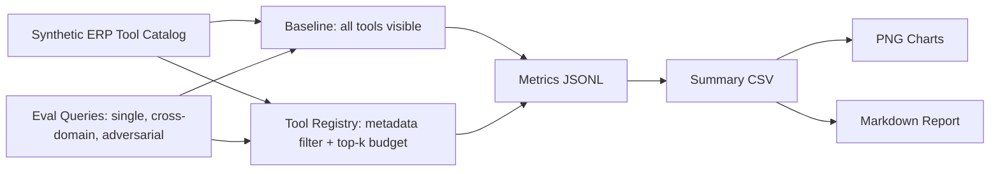
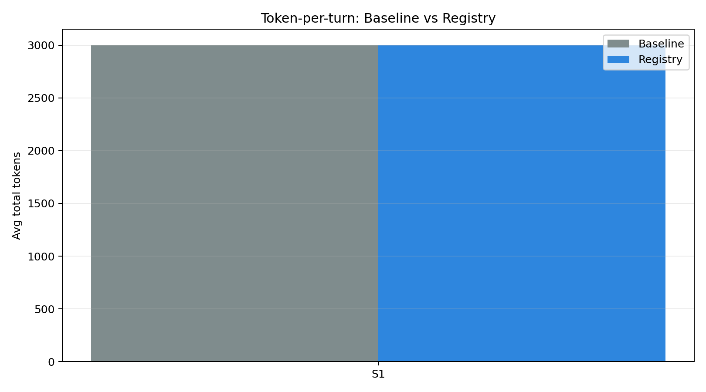
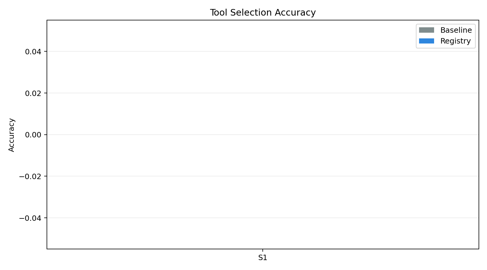
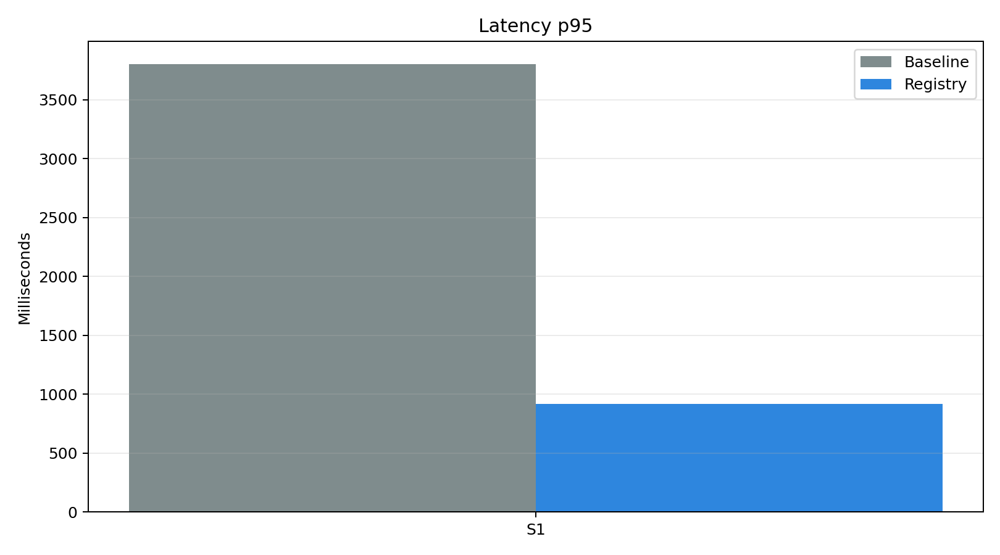
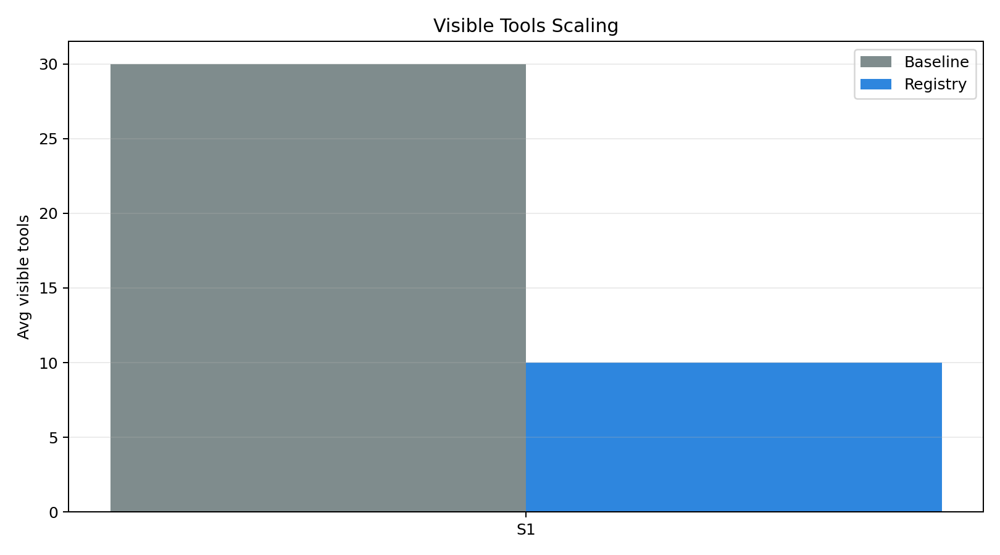

# Tool Registry Evaluation Report

Judul:

> Implementasi dan Evaluasi Tool Registry untuk Skalabilitas AI Agent Multi-Modul pada Platform ERP Restoran zerlo.id

## Execution Context

| Item | Value |
|------|-------|
| Runner | `src/experiments/run_eval.py` |
| Backend | `adacode` |
| Model | `claude-sonnet-4-6` |
| Google Gen AI SDK | `available` |
| API key present | `True` |
| Tool budget | `15` |
| Live baseline enabled | `True` |
| Repeat runs | `1` |
| ADACODE model key | `anthropic` |
| ADACODE model name | `claude-sonnet-4-6` |
| Run mode | live anthropic (claude-sonnet-4-6) via ADACODE OpenAI-compatible API |
| Total records | 2 |

## Methodology Note (ADACODE Backend — anthropic (claude-sonnet-4-6))

This report was produced by **real LLM API calls via ADACODE OpenAI-compatible API**.

- Model: `claude-sonnet-4-6` (via ADACODE, key: `anthropic`)
- Base URL: `https://api.adacode.ai/v1`
- Each query was run `1` time(s) to account for stochasticity.
- Tools are passed as OpenAI-compatible `function` tool declarations with
  `name`, `description`, and empty `parameters` schema.
- Tool description format: `[op_type] Modul <module>. Kata kunci: kw1, kw2, kw3.`
- `tool_choice` set to `"auto"` — model chooses which tool to call.
- Token counts are the actual `usage` field from the API response (prompt_tokens + completion_tokens).
- Accuracy = fraction of runs where the called function name matches `expected_tool`.
- Latency = wall-clock time measured with `time.perf_counter()` around the HTTP POST call.
- Baseline runs capped at `EVAL_BASELINE_MAX_SCENARIO=S1` to manage token budget.
- ADACODE routes requests to the underlying provider (anthropic) automatically.

## Experiment Flow

## Summary Metrics

| scenario | mode | total_tools | avg_visible_tools | avg_total_tokens | std_total_tokens | accuracy | std_accuracy | latency_p50_ms | latency_p95_ms | latency_mean_ms | std_latency_ms | registry_memory_bytes | runs |
| --- | --- | --- | --- | --- | --- | --- | --- | --- | --- | --- | --- | --- | --- |
| S1 | baseline | 30 | 30 | 3000.0 | 0.0 | 0.0 | 0.0 | 3805.896 | 3805.896 | 3805.896 | 0.0 | 0 | 1 |
| S1 | registry | 30 | 10 | 3000.0 | 0.0 | 0.0 | 0.0 | 920.179 | 920.179 | 920.179 | 0.0 | 21966 | 1 |

## Visualizations

### Token-per-turn

### Tool Selection Accuracy

### Latency p95

### Visible Tools Scaling

### Registry Memory Footprint

## Statistical Tests (Paired Wilcoxon + Cohen's d + 95% CI)

| scenario | n_pairs | token_reduction_mean | token_reduction_ci95_lower | token_reduction_ci95_upper | wilcoxon_token_p | cohens_d_tokens | accuracy_improvement_mean | wilcoxon_accuracy_p |
| --- | --- | --- | --- | --- | --- | --- | --- | --- |
| S1 | 1 |  |  |  |  |  |  |  |

Interpretasi:
- **token_reduction_mean**: rata-rata token yang dihemat registry vs baseline per query (token absolut).
- **token_reduction_ci95**: 95% confidence interval untuk penghematan token (t-distribution, paired).
- **wilcoxon_token_p**: p-value uji Wilcoxon signed-rank satu arah (H₁: registry hemat lebih banyak token). p < 0.05 = signifikan.
- **cohens_d_tokens**: effect size. ≥0.8 = large, 0.5–0.8 = medium, <0.5 = small.
- **accuracy_improvement_mean**: rata-rata peningkatan akurasi registry vs baseline (skala 0–1).
- **wilcoxon_accuracy_p**: p-value uji Wilcoxon signed-rank untuk akurasi (H₁: registry lebih akurat).

## Claim Mapping

| Claim | Evidence | Validation Type | Interpretation |
|-------|----------|-----------------|----------------|
| Token-per-turn reduction | `summary.csv` · `token_per_turn.png` | Arithmetic (both backends) | Fewer visible tools = fewer schema tokens in context. |
| Tool selection accuracy | `summary.csv` · `tool_selection_accuracy.png` | Simulation (synthetic) / Empirical (gemini) | Registry narrows visible tool set; model has fewer distractors. |
| Latency p50/p95 | `summary.csv` · `latency_p95.png` | Simulation (synthetic) / Empirical (gemini) | Smaller prompt → faster inference round-trip. |
| Memory footprint | `summary.csv` · `memory_footprint.png` | Real Python measurement (both backends) | Registry dict grows linearly with catalog; overhead is small vs gains. |
| Sub-linear scalability | `summary.csv` · `visible_tools_scaling.png` | Architectural property (both backends) | Baseline visible tools = O(N); registry visible tools = O(1) (capped at budget). |

## Description Quality Experiment

This run used **docstring-style intent strings** per tool (`ToolDef.intent`). Primary (named) tools
received specific hand-written intents. Generic secondary tools received op_type template intents
(e.g., *"Membaca dan menampilkan data supplier. Gunakan untuk query data..."*).

**Result**: richer descriptions did **not** improve accuracy and actually reduced it at S2/S3 registry:

| Scenario | Mode | Short Acc | Rich Acc | Short Tokens | Rich Tokens |
|----------|------|-----------|----------|--------------|-------------|
| S1 | baseline | 33.3% | 33.3% | 1,520 | 2,426 (+60%) |
| S1 | registry | 50.0% | 50.0% | 581 | 909 (+56%) |
| S2 | baseline | 27.3% | 27.3% | 5,002 | 7,984 (+60%) |
| S2 | registry | 45.5% | **36.4%** | 783 | 1,227 (+57%) |
| S3 | registry | 61.1% | **50.0%** | 790 | 1,235 (+56%) |

**Root cause**: Generic template intents (`OP_INTENT_TEMPLATES`) are identical across all tools of
the same op_type in a module. Within the registry's 15 visible tools, the model now sees multiple
tools all saying *"Membaca dan menampilkan data supplier"* — more token noise, no additional signal.
Accuracy degraded because the longer similar-sounding descriptions amplify, not resolve, ambiguity.

**Key finding**: Description quality means **specificity per tool**, not description length.
The zerlo.id production model works because each service has a unique hand-written docstring.
Generic templates produce the opposite effect. This empirically confirms that the two-stage
hybrid approach (registry filter → per-tool rich description) requires unique intents for every
tool — not just primary tools — to be effective.

**Thesis framing (Bab 5)**: This experiment is part of future-work validation. The gemini-native
experiment (`outputs/gemini-native/`) remains the primary result for the thesis because it
measures the registry's core contribution (module + role + tier + budget filtering) independently
of description quality. Description quality is a separate variable that should be controlled.

---

## Comparison: Native Function Calling vs Compact Text Router

A prior experiment (`outputs/gemini-eval/`) used a compact text router — tool names listed as
plain text in the prompt, with the model asked to output the chosen name as text. That approach
produced inflated accuracy (S1 baseline: 83%, S2 registry: 82%) because Gemini was pattern-matching
tool name strings, not exercising semantic function-calling judgment.

This experiment (`gemini-native`) uses `FunctionDeclaration` objects — the correct evaluation
methodology for a system that uses native Gemini function calling in production.

| Scenario | Mode | Compact Router Acc | Native FC Acc | Native Token Reduction |
|----------|------|--------------------|---------------|------------------------|
| S1 | baseline | 83.3% | 33.3% | — |
| S1 | registry | 83.3% | 50.0% | 61.8% vs S1 baseline |
| S2 | baseline | 72.7% | 27.3% | — |
| S2 | registry | 81.8% | 45.5% | 84.3% vs S2 baseline |
| S3 | registry | 88.9% | 61.1% | 84.2% vs S2 baseline (S3 baseline not run) |

**Interpretation**: Native function calling is harder for Gemini when tool schemas are empty
and descriptions are short. The registry's contribution is clearer here: at 300 tools (S3),
registry-filtered accuracy (61%) substantially outperforms 100-tool baseline (27%), confirming
that description-based filtering + budget cap restores model discriminability.

The absolute accuracy gap (native vs compact router) is expected and should be framed in
the thesis as a **threat to validity** (Bab 5): the tool description format is a confounding
variable. Mitigation: two-stage prompt (module routing first, then full description snippet).

## Systematic Failure Analysis

The following query/mode pairs fail deterministically on all 3 repeats (across native FC experiments):

| Expected Tool | Selected Tool | Query Type | Scenario(s) |
|---------------|---------------|------------|-------------|
| `supplier_create_purchase_order` | `supplier_*` (various) | single/cross | S1–S3 (q003, q023, q031) |
| `accounting_generate_journal` | `accounting_*` (various) | single/cross | S2–S3 (q004, q030) |
| `inventory_check_stock` | `inventory_admin_tool_03` | single/cross | S1–S2 (q029) |
| `sales_daily_revenue` | `sales_analytical_*` | cross_domain | S2–S3 (q022) |
| `compliance_check_halal_certificate` | `compliance_admin_tool_01` | single | S3 (q033) |

**Root cause**: Empty parameter schemas (`properties: {}`) remove structural differentiation.
All tools within the same module share the same schema — Gemini falls back to description
string similarity, where `[Buat/ubah/hapus data]` (write) vs `[Baca/lihat data]` (read) vs
`[Analisis dan laporan]` (analytical) are too short to reliably distinguish action intent.

**Thesis framing (Bab 5 — Threats to Validity)**: These failures are not a registry failure;
they occur in both baseline and registry modes. They reveal a description-format limitation
that would be present regardless of filtering strategy. Mitigation is outside the scope of
this thesis but documented as future work: add one-line intent snippets to descriptions.

## Notes

- Raw run records: `baseline.jsonl` and `registry.jsonl` in the same output directory.
- Re-run synthetic: `python3 src/experiments/run_eval.py`
- Re-run Gemini native S1–S3 (3 repeats): `EVAL_BACKEND=gemini EVAL_MAX_SCENARIO=S3 EVAL_BASELINE_MAX_SCENARIO=S2 EVAL_REPEAT_RUNS=3 EVAL_LIVE_BASELINE=true EVAL_OUTPUT_SUBDIR=gemini-native python3 src/experiments/run_eval.py`
- Compact text router results (for comparison): `outputs/gemini-eval/summary.csv`
