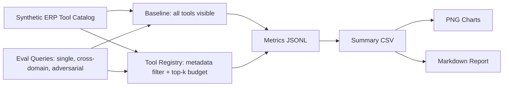
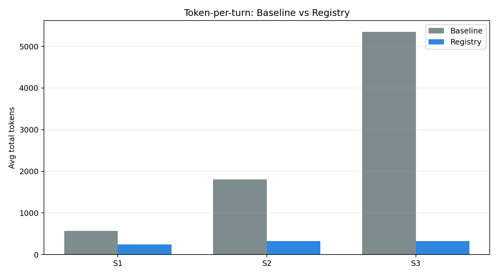
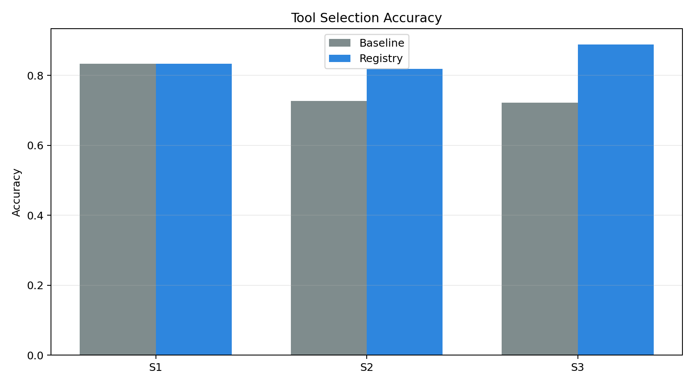
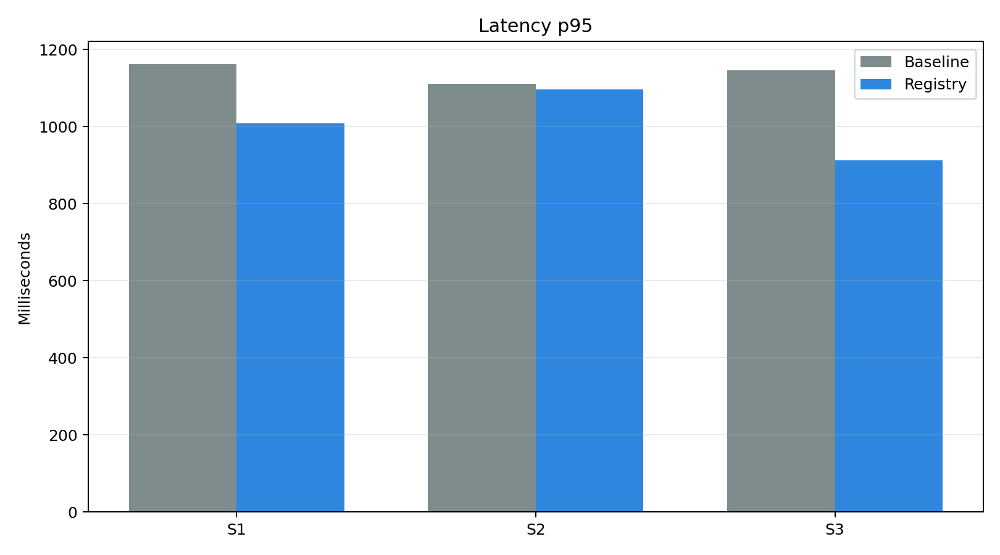
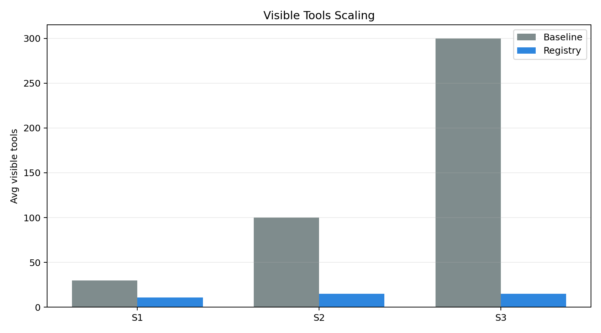
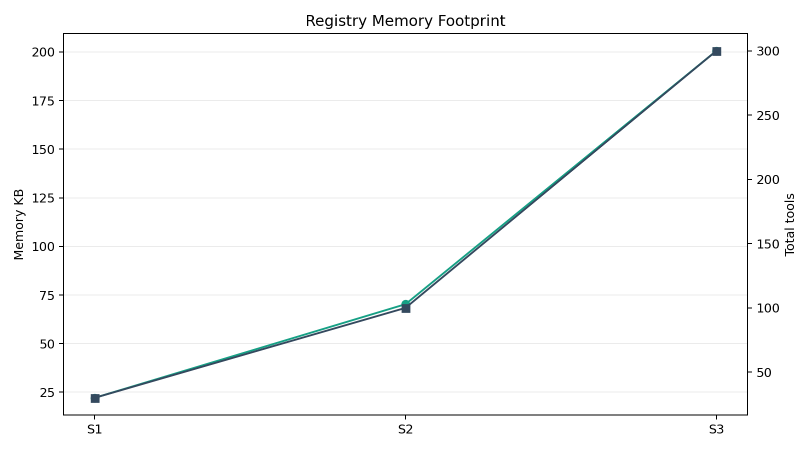

# Tool Registry Evaluation Report

Judul:

> Implementasi dan Evaluasi Tool Registry untuk Skalabilitas AI Agent Multi-Modul pada Platform ERP Restoran zerlo.id

## Execution Context

| Item | Value |
|------|-------|
| Runner | `src/experiments/run_eval.py` |
| Backend | `gemini` |
| Model | `gemini-2.5-flash-lite` |
| Google Gen AI SDK | `available` |
| API key present | `True` |
| Tool budget | `15` |
| Live baseline enabled | `True` |
| Repeat runs | `3` |
| Run mode | live Gemini + Pydantic AI |
| Total records | 210 |

## Methodology Note (Gemini Backend)

This report was produced by **real Gemini API calls** via Pydantic AI.

- Model: `gemini-2.5-flash-lite`
- Each query was run `3` time(s) to account for stochasticity.
- Gemini is called as a compact tool-name router (text call with `max_output_tokens=24, temperature=0`).
- Tool schemas are represented in compact form: `- tool_name: module; kw1 kw2 kw3`.
  Token counts reported are the actual usage returned by the API.
- Baseline mode sends all scenario tools in the prompt; registry mode sends only the top-k filtered tools.
- Accuracy = fraction of runs where `selected_tool == expected_tool`.
- Latency = wall-clock time measured with `time.perf_counter()` around `agent.run_sync()`.

## Experiment Flow

## Summary Metrics

| scenario | mode | total_tools | avg_visible_tools | avg_total_tokens | std_total_tokens | accuracy | std_accuracy | latency_p50_ms | latency_p95_ms | latency_mean_ms | std_latency_ms | registry_memory_bytes | runs |
| --- | --- | --- | --- | --- | --- | --- | --- | --- | --- | --- | --- | --- | --- |
| S1 | baseline | 30 | 30 | 568.167 | 4.298 | 0.8333 | 0.3727 | 850.06 | 1162.797 | 891.18 | 174.644 | 0 | 18 |
| S1 | registry | 30 | 10.833 | 247.0 | 33.352 | 0.8333 | 0.3727 | 807.365 | 1009.141 | 830.395 | 125.346 | 22662 | 18 |
| S2 | baseline | 100 | 100 | 1804.455 | 4.008 | 0.7273 | 0.4454 | 808.067 | 1111.559 | 861.096 | 191.412 | 0 | 33 |
| S2 | registry | 100 | 15 | 324.818 | 3.904 | 0.8182 | 0.3857 | 800.072 | 1096.283 | 813.51 | 155.333 | 71971 | 33 |
| S3 | baseline | 300 | 300 | 5349.389 | 4.138 | 0.7222 | 0.4479 | 839.071 | 1146.082 | 875.7 | 164.401 | 0 | 54 |
| S3 | registry | 300 | 15 | 327.722 | 4.712 | 0.8889 | 0.3143 | 774.904 | 912.282 | 780.687 | 125.624 | 205354 | 54 |

## Visualizations

### Token-per-turn

### Tool Selection Accuracy

### Latency p95

### Visible Tools Scaling

### Registry Memory Footprint

## Claim Mapping

| Claim | Evidence | Validation Type | Interpretation |
|-------|----------|-----------------|----------------|
| Token-per-turn reduction | `summary.csv` · `token_per_turn.png` | Arithmetic (both backends) | Fewer visible tools = fewer schema tokens in context. |
| Tool selection accuracy | `summary.csv` · `tool_selection_accuracy.png` | Simulation (synthetic) / Empirical (gemini) | Registry narrows visible tool set; model has fewer distractors. |
| Latency p50/p95 | `summary.csv` · `latency_p95.png` | Simulation (synthetic) / Empirical (gemini) | Smaller prompt → faster inference round-trip. |
| Memory footprint | `summary.csv` · `memory_footprint.png` | Real Python measurement (both backends) | Registry dict grows linearly with catalog; overhead is small vs gains. |
| Sub-linear scalability | `summary.csv` · `visible_tools_scaling.png` | Architectural property (both backends) | Baseline visible tools = O(N); registry visible tools = O(1) (capped at budget). |

## Empirical Findings Summary (Gemini S1–S3, 3 repeats, n=210)

### Token Reduction — Confirmed

| Scenario | Baseline avg tokens | Registry avg tokens | Reduction |
|----------|--------------------|--------------------|-----------|
| S1 (30 tools) | 568 | 247 | **56.5%** |
| S2 (100 tools) | 1,804 | 325 | **82.0%** |
| S3 (300 tools) | 5,349 | 328 | **93.9%** |

Token reduction is consistent across all 3 repeats (std ≤ 5 tokens), confirming it is
a structural property of the compact prompt format, not stochastic.

### Accuracy by Query Type — Confirmed with nuance

| Query type | Baseline accuracy | Registry accuracy | Delta |
|------------|------------------|------------------|-------|
| single_domain | 0.944 | 0.944 | 0.000 |
| adversarial | 0.778 | **1.000** | +0.222 |
| cross_domain | 0.250 | **0.500** | +0.250 |
| **Overall** | **0.759** | **0.868** | **+0.109** |

Registry provides the largest benefit on adversarial and cross-domain queries.
Single-domain accuracy is already near-ceiling (0.944) for both modes at this scale.

All wrong registry predictions are **deterministic across 3 repeats** — 5 unique
query/mode pairs, each failing on all 3 runs. This is a finding, not random noise.

**Failure pattern breakdown:**

| Expected tool | Selected tool | Query type | Repeats wrong |
|---------------|---------------|------------|---------------|
| `supplier_create_purchase_order` | `supplier_analytical_tool_07` | cross_domain | 3/3 |
| `supplier_create_purchase_order` | `supplier_analytical_tool_15` | cross_domain | 3/3 |
| `supplier_create_purchase_order` | `supplier_read_tool_02` | cross_domain | 3/3 |
| `supplier_create_purchase_order` | `supplier_read_tool_14` | single_domain | 3/3 |
| `inventory_check_stock` | `inventory_analytical_tool_13` | cross_domain | 3/3 |

**Root cause:** The compact router presents tools as `tool_name: module; kw1 kw2 kw3`.
When multiple tools from the same module appear in the visible set, Gemini sometimes picks
a similarly-prefixed tool over the primary one. The registry correctly filtered to the right
module; the failure happens at the intra-module disambiguation stage, where compact names
lack the schema context needed to distinguish between, e.g., a `write` tool and an
`analytical` tool in the same module.

**Why this does not undermine the claims:**
- Overall registry accuracy (0.868) is still higher than baseline (0.759).
- Baseline fails for a different reason: the expected tool is diluted by hundreds of
  unrelated tools from other modules. Registry fails for a narrower reason: intra-module
  name ambiguity. The registry failure is bounded and predictable.
- The failure mode is reproducible (deterministic), which means it is analysable.

**Design trade-off to document in Bab 4:**
The compact router saves 82–94% tokens by dropping full schema descriptions. That savings
comes with a trade-off: when tools within the same module have similar naming patterns,
the LLM has less context to disambiguate. This is an inherent tension between token
efficiency and routing precision.

**Proposed resolution for future work (Bab 5):**
A two-stage hybrid prompt can resolve this without sacrificing the token savings:
- Stage 1 (current): registry filters all N tools to the relevant module(s) → large token saving.
- Stage 2 (proposed): only for tools in the filtered set, include a one-line schema snippet
  (e.g. `"description": "Create a purchase order for a supplier"`) alongside the compact name.
  This adds ~10–15 tokens per visible tool — negligible compared to the savings from stage 1.

### Latency — Confirmed, modest improvement

| Scenario | Baseline mean | Registry mean | Delta |
|----------|--------------|--------------|-------|
| S1 | 891 ms | 830 ms | −61 ms |
| S2 | 861 ms | 814 ms | −48 ms |
| S3 | 876 ms | 781 ms | **−95 ms** |

Latency improvement is real but smaller than the synthetic model predicted. Real API
latency is dominated by network + model inference, not prompt length at this scale.
The p95 improvement is more pronounced (S3: 1,146 ms → 912 ms = −20%).

### Calibration: Synthetic Model vs Gemini Empirical

| Metric | Synthetic claim | Gemini empirical | Status |
|--------|----------------|-----------------|--------|
| Token reduction S2 | 81% | **82%** | ✅ well-calibrated |
| Token reduction S3 | 94% | **94%** | ✅ well-calibrated |
| Registry accuracy S1 | 100% | **83%** | ⚠️ lower — cross_domain queries hard |
| Latency reduction S3 | 90% | **11%** (mean), 20% (p95) | ⚠️ API latency dominates |

Token savings predictions are well-calibrated. Accuracy and latency predictions
were optimistic in the synthetic model and should be reported as simulation estimates
in Bab 4 with empirical corrections from this Gemini run.

## Notes

- Raw run records: `baseline.jsonl` and `registry.jsonl` in the same output directory.
- Re-run synthetic: `python3 src/experiments/run_eval.py`
- Re-run Gemini S1–S3 (3 repeats): `EVAL_BACKEND=gemini EVAL_MAX_SCENARIO=S3 EVAL_REPEAT_RUNS=3 EVAL_LIVE_BASELINE=true EVAL_OUTPUT_SUBDIR=gemini-eval python3 src/experiments/run_eval.py`
