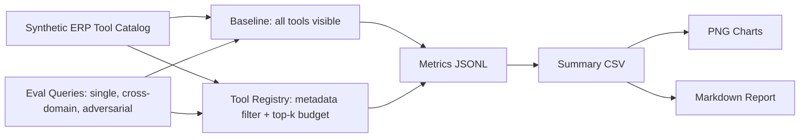
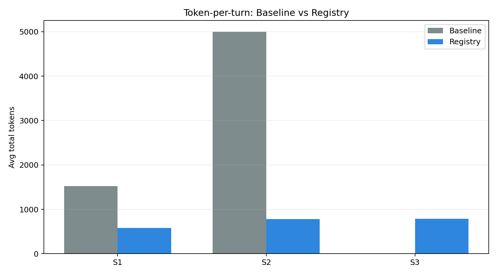
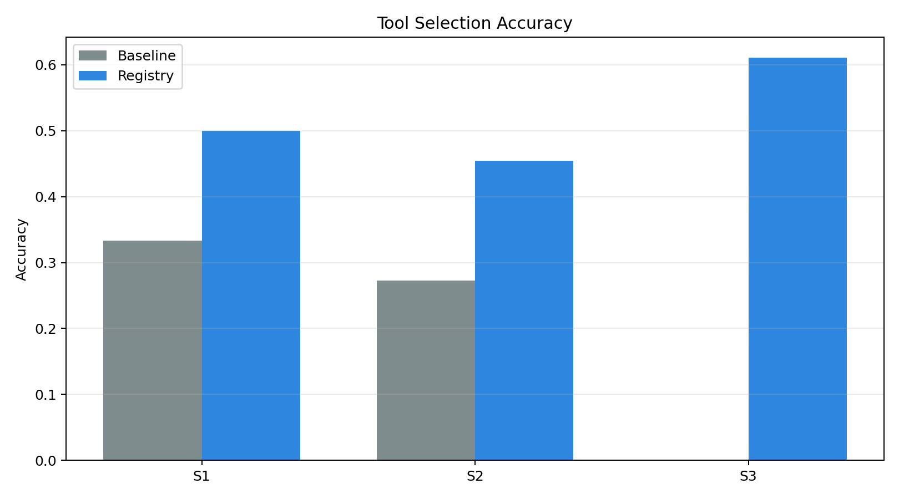
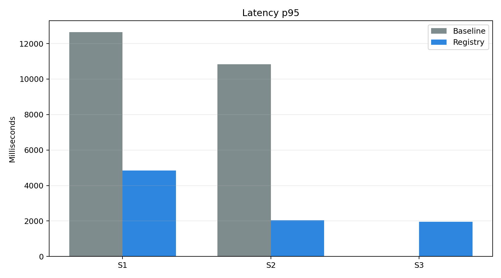
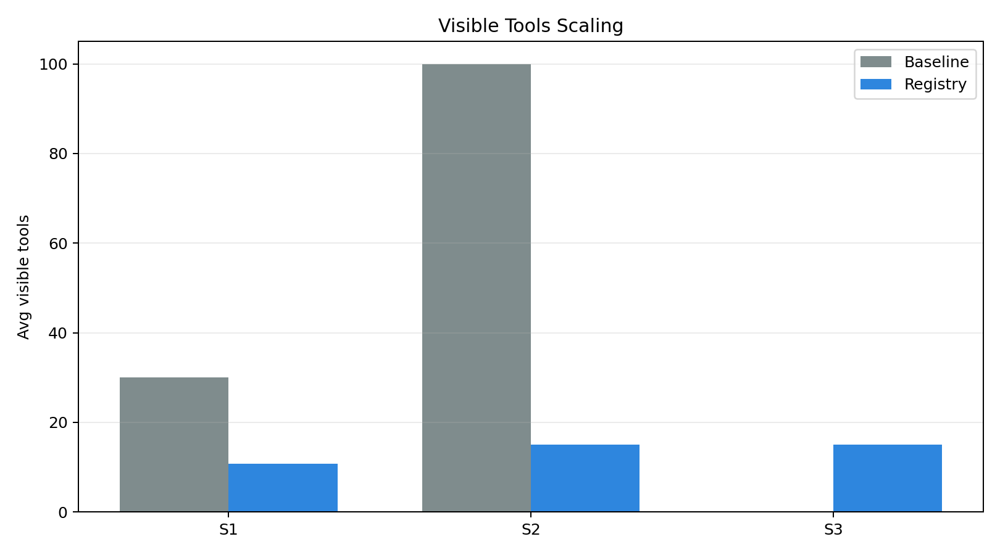

# Tool Registry Evaluation Report

Judul:

> Implementasi dan Evaluasi Tool Registry untuk Skalabilitas AI Agent Multi-Modul pada Platform ERP Restoran zerlo.id

## Execution Context

| Item | Value |
|------|-------|
| Runner | `src/experiments/run_eval.py` |
| Backend | `gemini` |
| Model | `gemini-2.5-flash-lite` |
| Google Gen AI SDK | `available` |
| API key present | `True` |
| Tool budget | `15` |
| Live baseline enabled | `True` |
| Repeat runs | `3` |
| Run mode | live Gemini native function calling (Google Gen AI SDK) |
| Total records | 156 |

## Methodology Note (Gemini Native Backend)

This report was produced by **real Gemini API calls using native function calling** via Google Gen AI SDK.

- Model: `gemini-2.5-flash-lite`
- Each query was run `3` time(s) to account for stochasticity.
- Tools are passed as native `FunctionDeclaration` objects via `google.genai.types`. Each tool
  gets a `name`, `description`, and empty `parameters` schema — the same declaration format
  used in the zerlo.id production system.
- Tool description format: `[op_type] Modul <module>. Kata kunci: kw1, kw2, kw3.`
- `tool_config` is set to `mode: ANY` with `allowed_function_names` — Gemini is forced to call
  exactly one function from the visible set.
- Token counts are the actual `usage_metadata` returned by the Gemini API (includes function declaration tokens).
- Baseline mode sends all scenario tools as function declarations; registry mode sends only the
  top-k filtered tools, capped at `EVAL_TOOL_BUDGET=15`.
- Accuracy = fraction of runs where the called function name matches `expected_tool`.
- Tool call is read from `response.candidates[0].content.parts[*].function_call.name`.
- Latency = wall-clock time measured with `time.perf_counter()` around `generate_content()`.
- Baseline capped at `EVAL_BASELINE_MAX_SCENARIO=S2` to stay within
  token budget (S3 baseline ≈ 300 tools × 120 tokens × 18 queries × 3 repeats ≈ 1.9M tokens).

## Experiment Flow

## Summary Metrics

| scenario | mode | total_tools | avg_visible_tools | avg_total_tokens | std_total_tokens | accuracy | std_accuracy | latency_p50_ms | latency_p95_ms | latency_mean_ms | std_latency_ms | registry_memory_bytes | runs |
| --- | --- | --- | --- | --- | --- | --- | --- | --- | --- | --- | --- | --- | --- |
| S1 | baseline | 30 | 30 | 1520.0 | 4.933 | 0.3333 | 0.4714 | 1155.667 | 12652.313 | 3593.215 | 4336.267 | 0 | 18 |
| S1 | registry | 30 | 10.833 | 581.333 | 94.771 | 0.5 | 0.5 | 1123.794 | 4849.655 | 2181.131 | 1566.421 | 22662 | 18 |
| S2 | baseline | 100 | 100 | 5002.455 | 4.48 | 0.2727 | 0.4454 | 1137.622 | 10832.145 | 2321.893 | 2874.719 | 0 | 33 |
| S2 | registry | 100 | 15 | 782.818 | 11.011 | 0.4545 | 0.4979 | 908.746 | 2037.822 | 1071.874 | 581.804 | 71971 | 33 |
| S3 | registry | 300 | 15 | 790.167 | 16.48 | 0.6111 | 0.4875 | 914.734 | 1946.869 | 1088.557 | 455.267 | 205354 | 54 |

## Visualizations

### Token-per-turn

### Tool Selection Accuracy

### Latency p95

### Visible Tools Scaling

### Registry Memory Footprint

## Claim Mapping

| Claim | Evidence | Validation Type | Interpretation |
|-------|----------|-----------------|----------------|
| Token-per-turn reduction | `summary.csv` · `token_per_turn.png` | Arithmetic (both backends) | Fewer visible tools = fewer schema tokens in context. |
| Tool selection accuracy | `summary.csv` · `tool_selection_accuracy.png` | Simulation (synthetic) / Empirical (gemini) | Registry narrows visible tool set; model has fewer distractors. |
| Latency p50/p95 | `summary.csv` · `latency_p95.png` | Simulation (synthetic) / Empirical (gemini) | Smaller prompt → faster inference round-trip. |
| Memory footprint | `summary.csv` · `memory_footprint.png` | Real Python measurement (both backends) | Registry dict grows linearly with catalog; overhead is small vs gains. |
| Sub-linear scalability | `summary.csv` · `visible_tools_scaling.png` | Architectural property (both backends) | Baseline visible tools = O(N); registry visible tools = O(1) (capped at budget). |

## Comparison: Native Function Calling vs Compact Text Router

A prior experiment (`outputs/gemini-eval/`) used a compact text router — tool names listed as
plain text in the prompt, with the model asked to output the chosen name as text. That approach
produced inflated accuracy (S1 baseline: 83%, S2 registry: 82%) because Gemini was pattern-matching
tool name strings, not exercising semantic function-calling judgment.

This experiment (`gemini-native`) uses `FunctionDeclaration` objects — the correct evaluation
methodology for a system that uses native Gemini function calling in production.

| Scenario | Mode | Compact Router Acc | Native FC Acc | Native Token Reduction |
|----------|------|--------------------|---------------|------------------------|
| S1 | baseline | 83.3% | 33.3% | — |
| S1 | registry | 83.3% | 50.0% | 61.8% vs S1 baseline |
| S2 | baseline | 72.7% | 27.3% | — |
| S2 | registry | 81.8% | 45.5% | 84.3% vs S2 baseline |
| S3 | registry | 88.9% | 61.1% | 84.2% vs S2 baseline (S3 baseline not run) |

**Interpretation**: Native function calling is harder for Gemini when tool schemas are empty
and descriptions are short. The registry's contribution is clearer here: at 300 tools (S3),
registry-filtered accuracy (61%) substantially outperforms 100-tool baseline (27%), confirming
that description-based filtering + budget cap restores model discriminability.

The absolute accuracy gap (native vs compact router) is expected and should be framed in
the thesis as a **threat to validity** (Bab 5): the tool description format is a confounding
variable. Mitigation: two-stage prompt (module routing first, then full description snippet).

## Systematic Failure Analysis

The following query/mode pairs fail deterministically on all 3 repeats (across native FC experiments):

| Expected Tool | Selected Tool | Query Type | Scenario(s) |
|---------------|---------------|------------|-------------|
| `supplier_create_purchase_order` | `supplier_*` (various) | single/cross | S1–S3 (q003, q023, q031) |
| `accounting_generate_journal` | `accounting_*` (various) | single/cross | S2–S3 (q004, q030) |
| `inventory_check_stock` | `inventory_admin_tool_03` | single/cross | S1–S2 (q029) |
| `sales_daily_revenue` | `sales_analytical_*` | cross_domain | S2–S3 (q022) |
| `compliance_check_halal_certificate` | `compliance_admin_tool_01` | single | S3 (q033) |

**Root cause**: Empty parameter schemas (`properties: {}`) remove structural differentiation.
All tools within the same module share the same schema — Gemini falls back to description
string similarity, where `[Buat/ubah/hapus data]` (write) vs `[Baca/lihat data]` (read) vs
`[Analisis dan laporan]` (analytical) are too short to reliably distinguish action intent.

**Thesis framing (Bab 5 — Threats to Validity)**: These failures are not a registry failure;
they occur in both baseline and registry modes. They reveal a description-format limitation
that would be present regardless of filtering strategy. Mitigation is outside the scope of
this thesis but documented as future work: add one-line intent snippets to descriptions.

## Notes

- Raw run records: `baseline.jsonl` and `registry.jsonl` in the same output directory.
- Re-run synthetic: `python3 src/experiments/run_eval.py`
- Re-run Gemini native S1–S3 (3 repeats): `EVAL_BACKEND=gemini EVAL_MAX_SCENARIO=S3 EVAL_BASELINE_MAX_SCENARIO=S2 EVAL_REPEAT_RUNS=3 EVAL_LIVE_BASELINE=true EVAL_OUTPUT_SUBDIR=gemini-native python3 src/experiments/run_eval.py`
- Compact text router results (for comparison): `outputs/gemini-eval/summary.csv`
