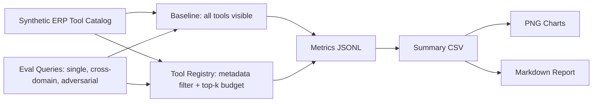
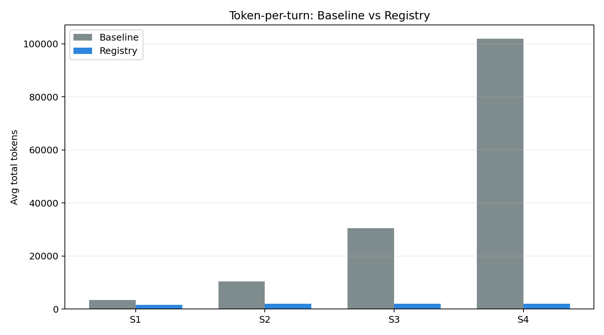
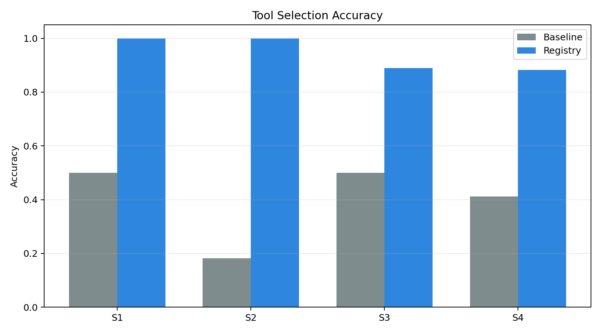
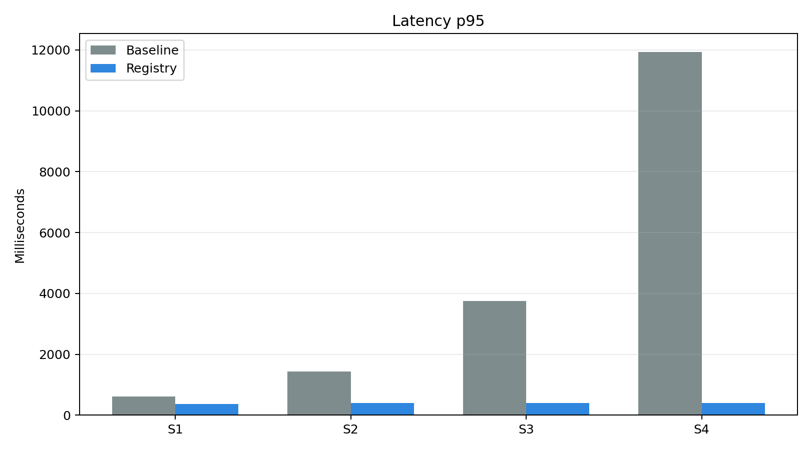
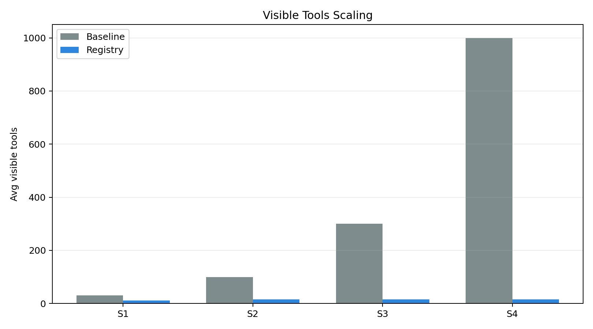
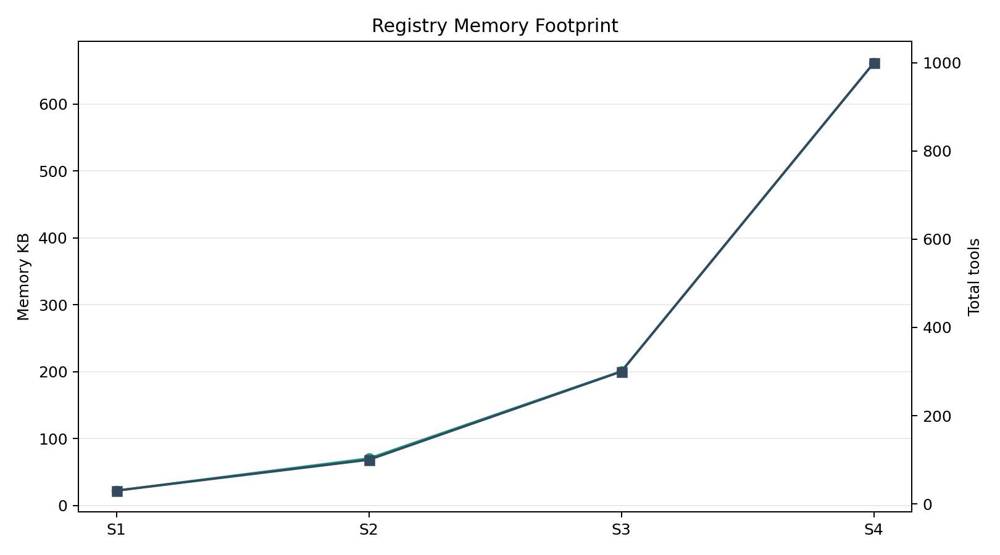

# Tool Registry Evaluation Report

Judul:

> Implementasi dan Evaluasi Tool Registry untuk Skalabilitas AI Agent Multi-Modul pada Platform ERP Restoran zerlo.id

## Execution Context

| Item | Value |
|------|-------|
| Runner | `src/experiments/run_eval.py` |
| Backend | `synthetic` |
| Model | `gemini-2.5-flash-lite` |
| Google Gen AI SDK | `available` |
| API key present | `True` |
| Tool budget | `15` |
| Live baseline enabled | `False` |
| Repeat runs | `1` |
| Run mode | synthetic deterministic benchmark |
| Total records | 138 |

## Methodology Note (Synthetic Backend)

This report was produced by a **deterministic simulation model**, not by real LLM calls.
Token counts are computed as `420 (prompt) + query_tokens + Σ schema_tokens(visible tools) + 72 (output)`.
Accuracy and latency are derived from parameterised penalty formulas:

- **Accuracy** — baseline probability degrades as `0.95 − min(0.56, log₁₀(N) × 0.19) − type_penalty`;
  registry probability degrades as `0.96 − min(0.08, log₁₀(K) × 0.035) − type_penalty`
  where N = total tools and K = visible tools after filtering.
- **Latency** — `185 + visible_tools × (7.4 | baseline, 3.1 | registry) + tokens × 0.042 + jitter`.

These coefficients are modelling assumptions calibrated to plausible LLM behaviour, **not measured from
real Gemini runs**. Token reduction and sub-linear scalability claims are arithmetic properties of the
formula and are valid. Accuracy and latency improvement claims must be confirmed with real LLM runs.

## Experiment Flow

## Summary Metrics

| scenario | mode | total_tools | avg_visible_tools | avg_total_tokens | accuracy | latency_p50_ms | latency_p95_ms | registry_memory_bytes | runs |
| --- | --- | --- | --- | --- | --- | --- | --- | --- | --- |
| S1 | baseline | 30 | 30 | 3422.833 | 0.5 | 582.02 | 610.662 | 0 | 6 |
| S1 | registry | 30 | 10.833 | 1560.0 | 1.0 | 337.685 | 366.832 | 22662 | 6 |
| S2 | baseline | 100 | 100 | 10410.182 | 0.1818 | 1384.344 | 1430.024 | 0 | 11 |
| S2 | registry | 100 | 15 | 1968.727 | 1.0 | 359.6 | 394.853 | 71971 | 11 |
| S3 | baseline | 300 | 300 | 30496.222 | 0.5 | 3708.302 | 3748.263 | 0 | 18 |
| S3 | registry | 300 | 15 | 1970.5 | 0.8889 | 359.162 | 397.174 | 205354 | 18 |
| S4 | baseline | 1000 | 1000 | 101969.882 | 0.4118 | 11891.476 | 11938.006 | 0 | 34 |
| S4 | registry | 1000 | 15 | 2013.588 | 0.8824 | 356.281 | 402.082 | 677404 | 34 |

## Visualizations

### Token-per-turn

### Tool Selection Accuracy

### Latency p95

### Visible Tools Scaling

### Registry Memory Footprint

## Claim Mapping

| Claim | Evidence | Validation Type | Interpretation |
|-------|----------|-----------------|----------------|
| Token-per-turn reduction | `summary.csv` · `token_per_turn.png` | Arithmetic (both backends) | Fewer visible tools = fewer schema tokens in context. |
| Tool selection accuracy | `summary.csv` · `tool_selection_accuracy.png` | Simulation (synthetic) / Empirical (gemini) | Registry narrows visible tool set; model has fewer distractors. |
| Latency p50/p95 | `summary.csv` · `latency_p95.png` | Simulation (synthetic) / Empirical (gemini) | Smaller prompt → faster inference round-trip. |
| Memory footprint | `summary.csv` · `memory_footprint.png` | Real Python measurement (both backends) | Registry dict grows linearly with catalog; overhead is small vs gains. |
| Sub-linear scalability | `summary.csv` · `visible_tools_scaling.png` | Architectural property (both backends) | Baseline visible tools = O(N); registry visible tools = O(1) (capped at budget). |

## Notes

- Raw run records: `baseline.jsonl` and `registry.jsonl` in the same output directory.
- Re-run synthetic: `python3 src/experiments/run_eval.py`
- Re-run Gemini S1–S3 (3 repeats): `EVAL_BACKEND=gemini EVAL_MAX_SCENARIO=S3 EVAL_REPEAT_RUNS=3 EVAL_LIVE_BASELINE=true EVAL_OUTPUT_SUBDIR=gemini-eval python3 src/experiments/run_eval.py`
