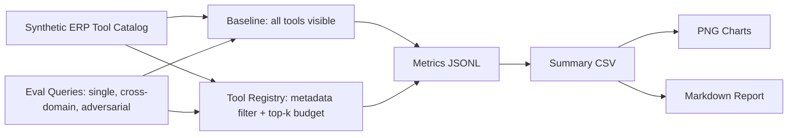
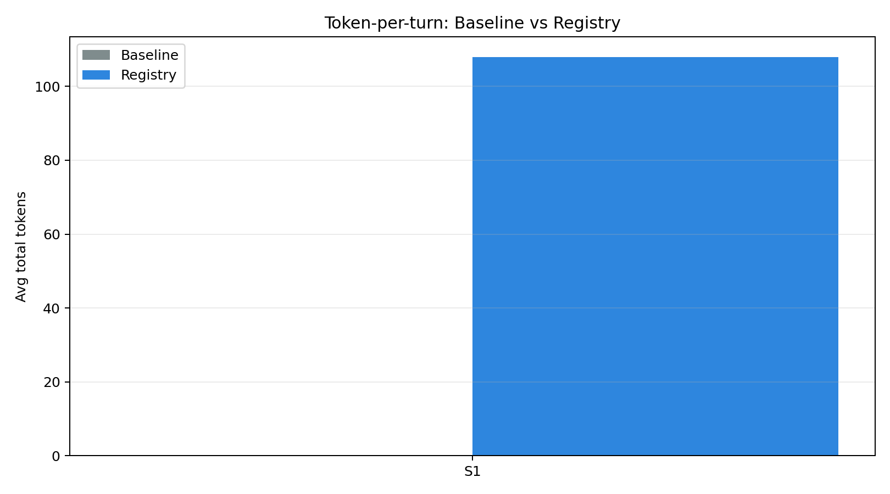
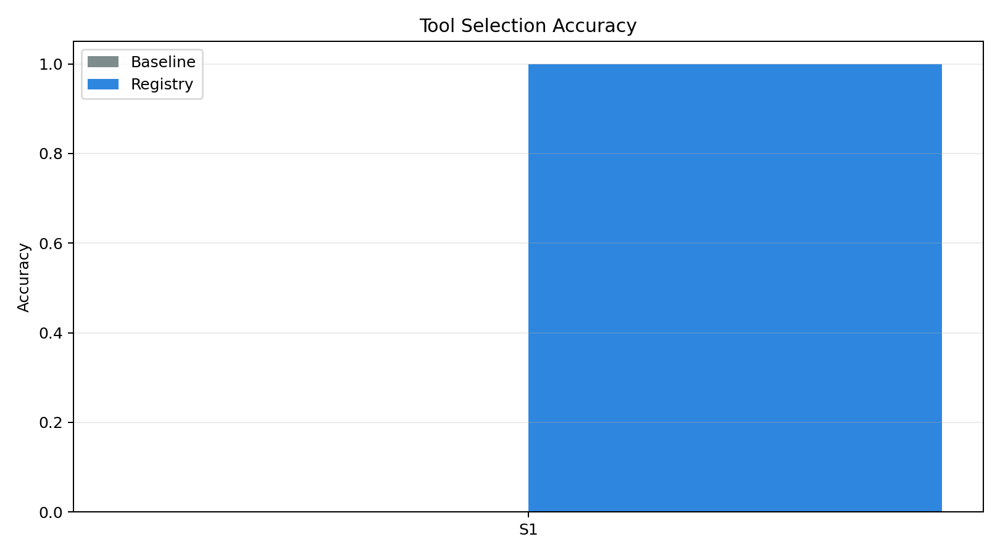
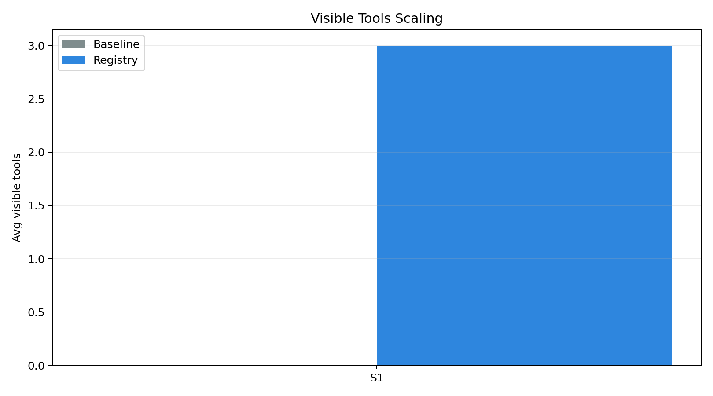

# Tool Registry Evaluation Report

Judul:

> Implementasi dan Evaluasi Tool Registry untuk Skalabilitas AI Agent Multi-Modul pada Platform ERP Restoran zerlo.id

## Execution Context

| Item | Value |
|------|-------|
| Runner | `src/experiments/run_eval.py` |
| Backend | `gemini` |
| Model env | `gemini-2.5-flash-lite` |
| Google Gen AI SDK import | `available` |
| API key present | `True` |
| Tool budget | `3` |
| Live baseline enabled | `False` |
| Run mode | live Gemini + Pydantic AI run with minimal visible tools |
| Total records | 1 |

## Experiment Flow

## Summary Metrics

| scenario | mode | total_tools | avg_visible_tools | avg_total_tokens | accuracy | latency_p50_ms | latency_p95_ms | registry_memory_bytes | runs |
| --- | --- | --- | --- | --- | --- | --- | --- | --- | --- |
| S1 | registry | 30 | 3 | 108 | 1.0 | 833.081 | 833.081 | 21966 | 1 |

## Visualizations

### Token-per-turn

### Tool Selection Accuracy

### Latency p95

### Visible Tools Scaling

### Registry Memory Footprint

## Claim Mapping

| Claim | Evidence File | Interpretation |
|-------|---------------|----------------|
| Token-per-turn before vs after | `outputs/summary.csv`, `charts/token_per_turn.png` | Registry keeps visible schemas small, reducing total tokens. |
| Tool selection accuracy | `outputs/summary.csv`, `charts/tool_selection_accuracy.png` | Registry improves selection stability under larger tool sets and adversarial queries. |
| Latency p50/p95 | `outputs/summary.csv`, `charts/latency_p95.png` | Lower visible tool count reduces end-to-end latency. |
| Memory footprint registry | `outputs/summary.csv`, `charts/memory_footprint.png` | Registry memory grows with catalog size but remains small relative to token/latency gains. |
| Scalability | `outputs/summary.csv`, `charts/visible_tools_scaling.png` | Baseline visible tools grow linearly; registry visible tools remain capped. |

## Notes

- Synthetic mode is the default and is deterministic.
- Gemini mode uses Pydantic AI and real Gemini calls when `EVAL_BACKEND=gemini`.
- To minimize token cost in Gemini mode, use `EVAL_MAX_SCENARIO=S1`, `EVAL_QUERY_LIMIT=5`, and `EVAL_TOOL_BUDGET=5`.
- Raw run records are split into `outputs/baseline.jsonl` and `outputs/registry.jsonl`.
